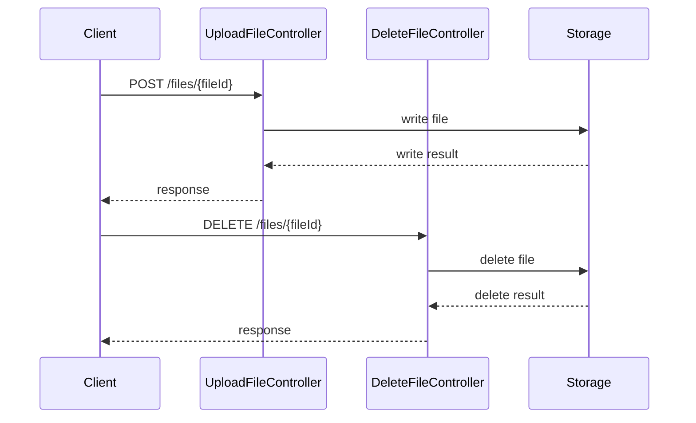

Proxy Application Selection refers to the process of choosing the appropriate controller to handle a specific request in the AI Dial Core application. This is achieved through the `ControllerSelector` class, which uses various patterns to match the incoming request path and HTTP method to the correct controller.

The `select` method in the `ControllerSelector` class is the main entry point for this process. It takes in a `Proxy` and `ProxyContext` object, and uses the request path and HTTP method from the `ProxyContext` to determine the appropriate controller.

Depending on the HTTP method of the request, the `select` method calls one of the `selectGet`, `selectPost`, `selectDelete`, or `selectPut` methods. Each of these methods uses a series of pattern matching operations to determine the correct controller for the request.

For example, the `selectGet` method uses patterns such as `PATTERN_DEPLOYMENT`, `PATTERN_DEPLOYMENTS`, `PATTERN_MODEL`, and others to match the request path. If a match is found, it creates a new instance of the corresponding controller (e.g., `DeploymentController`, `ModelController`) and returns a lambda function that calls the appropriate method on the controller (e.g., `getDeployment`, `getDeployments`, `getModel`).

The `selectPost`, `selectDelete`, and `selectPut` methods work in a similar way, but handle POST, DELETE, and PUT requests respectively. They also use different patterns and controllers based on the specifics of the request.

Once the appropriate controller is selected, the `handle` method of the controller is called to process the request. If no matching controller is found, a `RouteController` is used as a fallback.

In addition to the built-in controllers, the application also supports custom applications through the `CustomApplicationService`. This service provides methods to get public and shared applications, which can be used in the `ApplicationController` to handle requests related to custom applications.

<SwmSnippet path="/src/main/java/com/epam/aidial/core/controller/ControllerSelector.java" line="63">

---

# Controller Selection

The `select` method in the `ControllerSelector` class is the main entry point for Proxy Application Selection. It takes in a `Proxy` and `ProxyContext` object, and uses the request path and HTTP method from the `ProxyContext` to determine the appropriate controller.

```java
    public Controller select(Proxy proxy, ProxyContext context) {
        String path = context.getRequest().path();
        HttpMethod method = context.getRequest().method();
        Controller controller = null;

        if (method == HttpMethod.GET) {
            controller = selectGet(proxy, context, path);
        } else if (method == HttpMethod.POST) {
            controller = selectPost(proxy, context, path);
        } else if (method == HttpMethod.DELETE) {
            controller = selectDelete(proxy, context, path);
        } else if (method == HttpMethod.PUT) {
            controller = selectPut(proxy, context, path);
        }

        return (controller == null) ? new RouteController(proxy, context) : controller;
    }
```

---

</SwmSnippet>

<SwmSnippet path="/src/main/java/com/epam/aidial/core/controller/ControllerSelector.java" line="81">

---

# Selecting GET Requests

The `selectGet` method handles GET requests. It uses patterns such as `PATTERN_DEPLOYMENT`, `PATTERN_DEPLOYMENTS`, `PATTERN_MODEL`, and others to match the request path. If a match is found, it creates a new instance of the corresponding controller and returns a lambda function that calls the appropriate method on the controller.

```java
    private static Controller selectGet(Proxy proxy, ProxyContext context, String path) {
        Matcher match;

        match = match(PATTERN_DEPLOYMENT, path);
        if (match != null) {
            DeploymentController controller = new DeploymentController(context);
            String deploymentId = UrlUtil.decodePath(match.group(1));
            return () -> controller.getDeployment(deploymentId);
        }

        match = match(PATTERN_DEPLOYMENTS, path);
        if (match != null) {
            DeploymentController controller = new DeploymentController(context);
            return controller::getDeployments;
        }

        match = match(PATTERN_MODEL, path);
        if (match != null) {
            ModelController controller = new ModelController(context);
            String modelId = UrlUtil.decodePath(match.group(1));
            return () -> controller.getModel(modelId);
```

---

</SwmSnippet>

<SwmSnippet path="/src/main/java/com/epam/aidial/core/controller/ControllerSelector.java" line="214">

---

# Selecting POST Requests

The `selectPost` method handles POST requests. It uses a series of pattern matching operations to determine the correct controller for the request. If a match is found, it creates a new instance of the corresponding controller and returns a lambda function that calls the appropriate method on the controller.

```java
    private static Controller selectPost(Proxy proxy, ProxyContext context, String path) {
        Matcher match = match(PATTERN_POST_DEPLOYMENT, path);
        if (match != null) {
            String deploymentId = UrlUtil.decodePath(match.group(1));
            String deploymentApi = UrlUtil.decodePath(match.group(2));
            DeploymentPostController controller = new DeploymentPostController(proxy, context);
            return () -> controller.handle(deploymentId, deploymentApi);
        }

        match = match(PATTERN_RATE_RESPONSE, path);
        if (match != null) {
            String deploymentId = UrlUtil.decodePath(match.group(1));

            Function<Deployment, String> getter = (model) -> Optional.ofNullable(model)
                    .map(Deployment::getFeatures)
                    .map(Features::getRateEndpoint)
                    .orElse(null);

            DeploymentFeatureController controller = new DeploymentFeatureController(proxy, context);
            return () -> controller.handle(deploymentId, getter, false);
        }
```

---

</SwmSnippet>

<SwmSnippet path="/src/main/java/com/epam/aidial/core/controller/ControllerSelector.java" line="320">

---

# Selecting DELETE Requests

The `selectDelete` method handles DELETE requests. It uses a series of pattern matching operations to determine the correct controller for the request. If a match is found, it creates a new instance of the corresponding controller and returns a lambda function that calls the appropriate method on the controller.

```java
    private static Controller selectDelete(Proxy proxy, ProxyContext context, String path) {
        Matcher match = match(PATTERN_FILES, path);
        if (match != null) {
            DeleteFileController controller = new DeleteFileController(proxy, context);
            return () -> controller.handle(resourcePath(path));
        }

        match = match(PATTERN_RESOURCE, path);
        if (match != null) {
            ResourceController controller = new ResourceController(proxy, context, false);
            return () -> controller.handle(resourcePath(path));
        }

        match = match(INVITATION, path);
        if (match != null) {
            String invitationId = UrlUtil.decodePath(match.group(1));
            InvitationController controller = new InvitationController(proxy, context);
            return () -> controller.deleteInvitation(invitationId);
        }

        return null;
```

---

</SwmSnippet>

<SwmSnippet path="/src/main/java/com/epam/aidial/core/controller/ApplicationController.java" line="25">

---

# Custom Applications

In addition to the built-in controllers, the application also supports custom applications through the `CustomApplicationService`. This service provides methods to get public and shared applications, which can be used in the `ApplicationController` to handle requests related to custom applications.

```java
    private final CustomApplicationService customApplicationService;
    private final boolean includeCustomApplications;

    public ApplicationController(ProxyContext context, Proxy proxy) {
        this.context = context;
        this.vertx = proxy.getVertx();
        this.customApplicationService = proxy.getCustomApplicationService();
        this.includeCustomApplications = customApplicationService.includeCustomApplications();
    }
```

---

</SwmSnippet>

# File Operations

File Operations

<SwmSnippet path="/src/main/java/com/epam/aidial/core/controller/UploadFileController.java" line="1">

---

## UploadFileController

The `UploadFileController` class handles file upload requests. It extends the `AccessControlBaseController` class, which provides basic access control functionality. The `handle` method is overridden to provide specific handling for file upload requests. It checks if the resource is a folder or if the resource path is valid, and if not, it responds with a bad request status. If the resource is valid, it sets up a `BlobWriteStream` to write the uploaded file to the storage.

```java
package com.epam.aidial.core.controller;

import com.epam.aidial.core.Proxy;
import com.epam.aidial.core.ProxyContext;
import com.epam.aidial.core.storage.BlobWriteStream;
import com.epam.aidial.core.storage.ResourceDescription;
import com.epam.aidial.core.util.HttpStatus;
import io.vertx.core.Future;
import io.vertx.core.Promise;
import io.vertx.core.buffer.Buffer;
import io.vertx.core.streams.Pipe;
import io.vertx.core.streams.impl.PipeImpl;
import lombok.extern.slf4j.Slf4j;

@Slf4j
public class UploadFileController extends AccessControlBaseController {

    public UploadFileController(Proxy proxy, ProxyContext context) {
        super(proxy, context, true);
    }

```

---

</SwmSnippet>

<SwmSnippet path="/src/main/java/com/epam/aidial/core/controller/DeleteFileController.java" line="1">

---

## DeleteFileController

The `DeleteFileController` class handles file deletion requests. Similar to `UploadFileController`, it extends the `AccessControlBaseController` class. The `handle` method is overridden to provide specific handling for file deletion requests. It checks if the resource is a folder, and if so, it responds with a bad request status. If the resource is a file, it deletes the file from the storage.

```java
package com.epam.aidial.core.controller;

import com.epam.aidial.core.Proxy;
import com.epam.aidial.core.ProxyContext;
import com.epam.aidial.core.service.InvitationService;
import com.epam.aidial.core.service.LockService;
import com.epam.aidial.core.service.ShareService;
import com.epam.aidial.core.storage.BlobStorage;
import com.epam.aidial.core.storage.ResourceDescription;
import com.epam.aidial.core.util.HttpStatus;
import io.vertx.core.Future;
import lombok.extern.slf4j.Slf4j;

@Slf4j
public class DeleteFileController extends AccessControlBaseController {

    private final ShareService shareService;
    private final InvitationService invitationService;
    private final LockService lockService;

    public DeleteFileController(Proxy proxy, ProxyContext context) {
```

---

</SwmSnippet>



&nbsp;

*This is an auto-generated document by Swimm AI 🌊 and has not yet been verified by a human*

<SwmMeta version="3.0.0" repo-id="Z2l0aHViJTNBJTNBYWktZGlhbC1jb3JlLWRlbW8lM0ElM0FTd2ltbS1EZW1v" repo-name="ai-dial-core-demo" doc-type="overview"><sup>Powered by [Swimm](/)</sup></SwmMeta>
