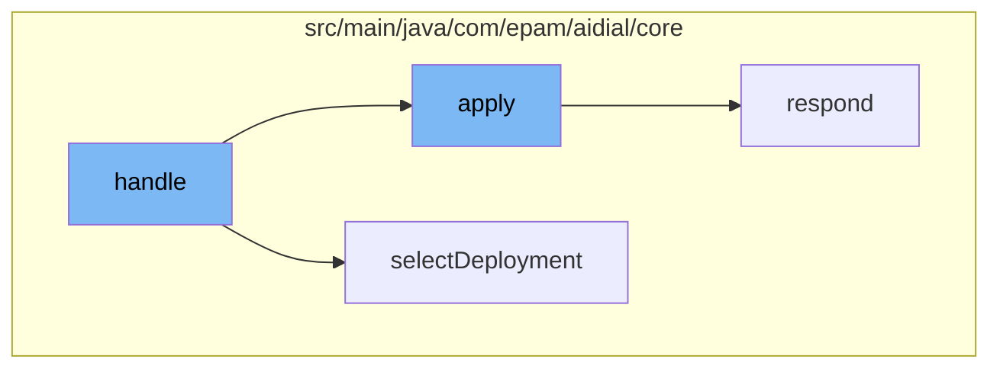

This document will cover the process of handling deployment features in the ai-dial-core-demo project. We'll cover:

1. The initial handling of deployment features
2. Collecting attachments
3. Responding to HTTP requests.



<SwmSnippet path="/src/main/java/com/epam/aidial/core/controller/DeploymentFeatureController.java" line="1">

---

# Initial handling of deployment features

The `handle` function in `DeploymentFeatureController.java` is the entry point for handling deployment features. It calls the `apply` function in `CollectAttachmentsFn.java` and `selectDeployment` function in `Config.java`.

```java
package com.epam.aidial.core.controller;

import com.epam.aidial.core.Proxy;
import com.epam.aidial.core.ProxyContext;
import com.epam.aidial.core.config.Deployment;
import com.epam.aidial.core.service.CustomApplicationService;
import com.epam.aidial.core.service.PermissionDeniedException;
import com.epam.aidial.core.service.ResourceNotFoundException;
import com.epam.aidial.core.util.BufferingReadStream;
import com.epam.aidial.core.util.HttpStatus;
```

---

</SwmSnippet>

<SwmSnippet path="/src/main/java/com/epam/aidial/core/function/CollectAttachmentsFn.java" line="29">

---

# Collecting attachments

The `apply` function in `CollectAttachmentsFn.java` is responsible for collecting attached files from the input `ObjectNode` tree. It uses the `ProxyUtil.collectAttachedFiles` function to process each attached file. If any exception occurs during this process, it will respond with the appropriate HTTP status and log the error.

```java
    @Override
    public Throwable apply(ObjectNode tree) {
        try {
            ProxyUtil.collectAttachedFiles(tree, this::processAttachedFile);
            // assign api key data after processing attachments
            ApiKeyData destApiKeyData = context.getProxyApiKeyData();
            proxy.getApiKeyStore().assignPerRequestApiKey(destApiKeyData);
            return null;
        } catch (HttpException e) {
            context.respond(e.getStatus(), e.getMessage());
            log.warn("Can't collect attached files. Trace: {}. Span: {}. Error: {}",
                    context.getTraceId(), context.getSpanId(), e.getMessage());
            return e;
        } catch (Throwable e) {
            context.respond(HttpStatus.BAD_REQUEST);
            log.warn("Can't collect attached files. Trace: {}. Span: {}. Error: {}",
                    context.getTraceId(), context.getSpanId(), e.getMessage());
            return e;
        }
    }
```

---

</SwmSnippet>

<SwmSnippet path="/src/main/java/com/epam/aidial/core/Proxy.java" line="214">

---

# Responding to HTTP requests

The `respond` function in `Proxy.java` is used to send HTTP responses. It sets the HTTP status code and ends the response.

```java
    private void respond(HttpServerRequest request, HttpStatus status) {
        request.response().setStatusCode(status.getCode()).end();
    }
```

---

</SwmSnippet>

&nbsp;

*This is an auto-generated document by Swimm AI 🌊 and has not yet been verified by a human*

<SwmMeta version="3.0.0" repo-id="Z2l0aHViJTNBJTNBYWktZGlhbC1jb3JlLWRlbW8lM0ElM0FTd2ltbS1EZW1v" repo-name="ai-dial-core-demo" doc-type="flows"><sup>Powered by [Swimm](/)</sup></SwmMeta>
