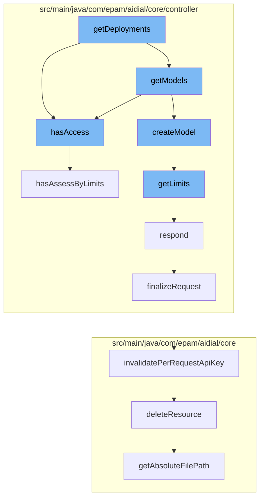

This document will cover the process of handling deployments in the ai-dial-core-demo project. We'll cover:

1. Checking access permissions
2. Retrieving models
3. Creating a model
4. Getting limit stats
5. Responding to the request
6. Finalizing the request
7. Invalidating per request API key
8. Deleting a resource



<SwmSnippet path="/src/main/java/com/epam/aidial/core/controller/DeploymentController.java" line="62">

---

# Checking access permissions

The function `hasAccess` checks if the context and deployment have access by limits and user roles.

```java
    public static boolean hasAccess(ProxyContext context, Deployment deployment) {
        return hasAssessByLimits(context, deployment) && hasAccessByUserRoles(context, deployment);
    }
```

---

</SwmSnippet>

<SwmSnippet path="/src/main/java/com/epam/aidial/core/controller/ModelController.java" line="21">

---

# Retrieving models

The function `getModels` is used to retrieve the models after checking access permissions.

```java
public class ModelController {

    private final ProxyContext context;

    public Future<?> getModel(String modelId) {
        Config config = context.getConfig();
        Model model = config.getModels().get(modelId);

        if (model == null) {
            return context.respond(HttpStatus.NOT_FOUND);
        }

        if (!DeploymentController.hasAccess(context, model)) {
            return context.respond(HttpStatus.FORBIDDEN);
```

---

</SwmSnippet>

<SwmSnippet path="/src/main/java/com/epam/aidial/core/controller/ModelController.java" line="21">

---

# Creating a model

The function `createModel` is used to create a model after retrieving the models.

```java
public class ModelController {

    private final ProxyContext context;

    public Future<?> getModel(String modelId) {
        Config config = context.getConfig();
        Model model = config.getModels().get(modelId);

        if (model == null) {
            return context.respond(HttpStatus.NOT_FOUND);
        }

        if (!DeploymentController.hasAccess(context, model)) {
            return context.respond(HttpStatus.FORBIDDEN);
```

---

</SwmSnippet>

<SwmSnippet path="/src/main/java/com/epam/aidial/core/controller/LimitController.java" line="21">

---

# Getting limit stats

The function `getLimits` retrieves the limit stats for a given deployment name.

```java
    public Future<?> getLimits(String deploymentName) {
        proxy.getRateLimiter().getLimitStats(deploymentName, context).onSuccess(limitStats -> {
            if (limitStats == null) {
                context.respond(HttpStatus.NOT_FOUND);
            } else {
                context.respond(HttpStatus.OK, limitStats);
            }
        }).onFailure(error -> {
            log.error("Failed to get limit stats", error);
            context.respond(HttpStatus.INTERNAL_SERVER_ERROR,
                    "Failed to get limit stats for deployment=%s".formatted(deploymentName));
        });
        return Future.succeededFuture();
    }
```

---

</SwmSnippet>

<SwmSnippet path="/src/main/java/com/epam/aidial/core/controller/DeploymentPostController.java" line="482">

---

# Responding to the request

The function `respond` is used to respond to the request with a status and error message if any.

```java
    private Future<Void> respond(HttpStatus status, String errorMessage) {
        finalizeRequest();
        return context.respond(status, errorMessage);
    }
```

---

</SwmSnippet>

<SwmSnippet path="/src/main/java/com/epam/aidial/core/controller/DeploymentPostController.java" line="497">

---

# Finalizing the request

The function `finalizeRequest` is used to finalize the request by ending the span and invalidating the per request API key.

```java
    private void finalizeRequest() {
        proxy.getTokenStatsTracker().endSpan(context);
        ApiKeyData proxyApiKeyData = context.getProxyApiKeyData();
        if (proxyApiKeyData != null) {
            proxy.getApiKeyStore().invalidatePerRequestApiKey(proxyApiKeyData)
                    .onSuccess(invalidated -> {
                        if (!invalidated) {
                            log.warn("Per request is not removed: {}", proxyApiKeyData.getPerRequestKey());
                        }
                    }).onFailure(error -> log.error("error occurred on invalidating per-request key", error));
        }
    }
```

---

</SwmSnippet>

<SwmSnippet path="/src/main/java/com/epam/aidial/core/security/ApiKeyStore.java" line="77">

---

# Invalidating per request API key

The function `invalidatePerRequestApiKey` is used to invalidate the per request API key.

```java
    /**
     * Invalidates per request API key.
     * If api key belongs to a project the operation will not have affect.
     *
     * @param apiKeyData associated with the key to be invalidated.
     * @return the future of the invalidation result: <code>true</code> means the key is successfully invalidated.
     */
    public Future<Boolean> invalidatePerRequestApiKey(ApiKeyData apiKeyData) {
        String apiKey = apiKeyData.getPerRequestKey();
        if (apiKey != null) {
            ResourceDescription resource = toResource(apiKey);
            return vertx.executeBlocking(() -> resourceService.deleteResource(resource), false);
        }
        return Future.succeededFuture(true);
    }
```

---

</SwmSnippet>

<SwmSnippet path="/src/main/java/com/epam/aidial/core/service/PublicationService.java" line="629">

---

# Deleting a resource

The function `deleteResource` is used to delete a resource based on its descriptor.

```java
    private void deleteResource(ResourceDescription descriptor) {
        switch (descriptor.getType()) {
            case FILE -> files.delete(descriptor.getAbsoluteFilePath());
            case PROMPT, CONVERSATION, APPLICATION -> resources.deleteResource(descriptor);
            default -> throw new IllegalStateException("Unsupported type: " + descriptor.getType());
        }
    }
```

---

</SwmSnippet>

&nbsp;

*This is an auto-generated document by Swimm AI 🌊 and has not yet been verified by a human*

<SwmMeta version="3.0.0" repo-id="Z2l0aHViJTNBJTNBYWktZGlhbC1jb3JlLWRlbW8lM0ElM0FTd2ltbS1EZW1v" repo-name="ai-dial-core-demo" doc-type="flows"><sup>Powered by [Swimm](/)</sup></SwmMeta>
