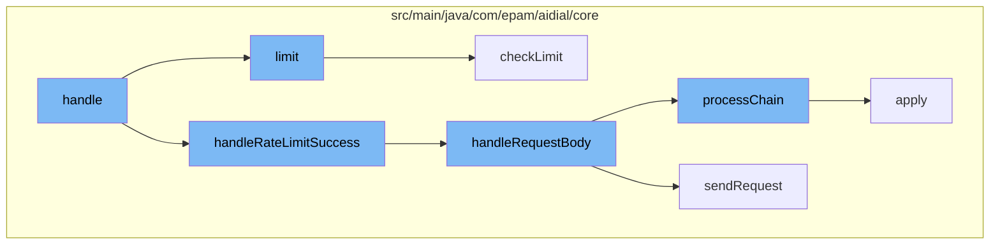

This document will cover the process of handling a deployment post request in the ai-dial-core-demo project. We'll cover:

1. Rate limiting of the request
2. Processing the request body
3. Applying enhancement functions to the request
4. Checking the rate limit.



<SwmSnippet path="/src/main/java/com/epam/aidial/core/limiter/RateLimiter.java" line="57">

---

# Rate limiting of the request

The `limit` function is used to apply rate limiting to the incoming request. If the limit is not positive or not found, the function returns a `FORBIDDEN` status. Otherwise, it proceeds to check the limit.

```java
    public Future<RateLimitResult> limit(ProxyContext context) {
        try {
            // skip checking limits if redis is not available
            if (resourceService == null) {
                return Future.succeededFuture(RateLimitResult.SUCCESS);
            }
            Key key = context.getKey();
            String deploymentName = context.getDeployment().getName();
            Limit limit;
            if (key == null) {
                limit = getLimitByUser(context, deploymentName);
            } else {
                limit = getLimitByApiKey(context, deploymentName);
            }

            if (limit == null || !limit.isPositive()) {
                if (limit == null) {
                    log.warn("Limit is not found for deployment: {}", deploymentName);
                } else {
                    log.warn("Limit must be positive for deployment: {}", deploymentName);
                }
```

---

</SwmSnippet>

<SwmSnippet path="/src/main/java/com/epam/aidial/core/controller/DeploymentPostController.java" line="227">

---

# Processing the request body

The `handleRequestBody` function is used to process the request body. It reads the request body and applies a chain of enhancement functions to it. If an error occurs during this process, the request is finalized and a response is sent.

```java
    @VisibleForTesting
    void handleRequestBody(Buffer requestBody) {
        Deployment deployment = context.getDeployment();
        log.info("Received body from client. Trace: {}. Span: {}. Key: {}. Deployment: {}. Length: {}",
                context.getTraceId(), context.getSpanId(),
                context.getProject(), deployment.getName(), requestBody.length());

        context.setRequestBody(requestBody);
        context.setRequestBodyTimestamp(System.currentTimeMillis());

        try (InputStream stream = new ByteBufInputStream(requestBody.getByteBuf())) {
            ObjectNode tree = (ObjectNode) ProxyUtil.MAPPER.readTree(stream);
            Throwable error = ProxyUtil.processChain(tree, enhancementFunctions);
            if (error != null) {
                finalizeRequest();
                return;
            }
        } catch (IOException e) {
            respond(HttpStatus.BAD_REQUEST);
            log.warn("Can't parse JSON request body. Trace: {}. Span: {}. Error:",
                    context.getTraceId(), context.getSpanId(), e);
```

---

</SwmSnippet>

<SwmSnippet path="/src/main/java/com/epam/aidial/core/util/ProxyUtil.java" line="212">

---

# Applying enhancement functions to the request

The `processChain` function is used to apply a chain of enhancement functions to the request. It iterates over the chain of functions and applies each one to the request. If an error occurs during this process, it is returned.

```java
    public static <T> Throwable processChain(T item, List<BaseFunction<T>> chain) {
        for (BaseFunction<T> fn : chain) {
            Throwable error = fn.apply(item);
            if (error != null) {
                return error;
            }
        }
        return null;
    }
```

---

</SwmSnippet>

<SwmSnippet path="/src/main/java/com/epam/aidial/core/limiter/RateLimiter.java" line="169">

---

# Checking the rate limit

The `checkLimit` function is used to check the rate limit of the request. It checks both the token limit and the request limit. If either limit is exceeded, a non-OK status is returned.

```java
    private RateLimitResult checkLimit(ProxyContext context, Limit limit) {
        long timestamp = System.currentTimeMillis();
        RateLimitResult tokenResult = checkTokenLimit(context, limit, timestamp);
        if (tokenResult.status() != HttpStatus.OK) {
            return tokenResult;
        }
        return checkRequestLimit(context, limit, timestamp);
    }
```

---

</SwmSnippet>

&nbsp;

*This is an auto-generated document by Swimm AI 🌊 and has not yet been verified by a human*

<SwmMeta version="3.0.0" repo-id="Z2l0aHViJTNBJTNBYWktZGlhbC1jb3JlLWRlbW8lM0ElM0FTd2ltbS1EZW1v" repo-name="ai-dial-core-demo" doc-type="flows"><sup>Powered by [Swimm](/)</sup></SwmMeta>
