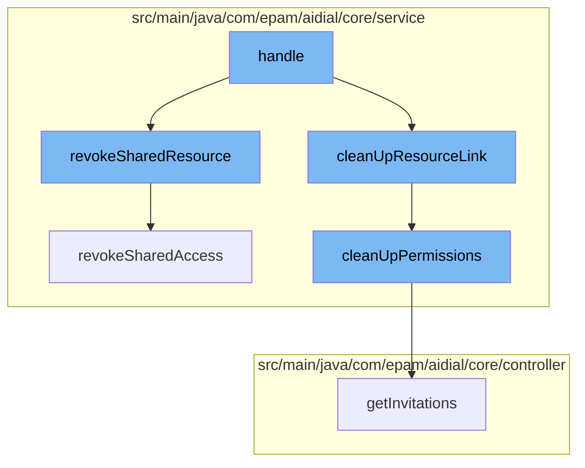

This document will cover the process of deleting a file in the ai-dial-core-demo project, which includes:

1. Handling the delete request
2. Revoking shared resources
3. Cleaning up resource links
4. Cleaning up permissions
5. Revoking shared access.



<SwmSnippet path="/src/main/java/com/epam/aidial/core/controller/DeleteFileController.java" line="1">

---

# Handling the delete request

The `handle` function in `DeleteFileController.java` is the entry point for the file deletion process. It receives the delete request and initiates the deletion process.

```java
package com.epam.aidial.core.controller;

import com.epam.aidial.core.Proxy;
import com.epam.aidial.core.ProxyContext;
import com.epam.aidial.core.service.InvitationService;
import com.epam.aidial.core.service.LockService;
import com.epam.aidial.core.service.ShareService;
import com.epam.aidial.core.storage.BlobStorage;
import com.epam.aidial.core.storage.ResourceDescription;
import com.epam.aidial.core.util.HttpStatus;
```

---

</SwmSnippet>

<SwmSnippet path="/src/main/java/com/epam/aidial/core/service/ShareService.java" line="254">

---

# Revoking shared resources

The `revokeSharedResource` function is called to revoke access to the resource that is about to be deleted. This ensures that no other user can access the file during the deletion process.

```java
    public void revokeSharedResource(
            String bucket, String location, ResourceDescription resourceLink) {
        revokeSharedAccess(bucket, location, Map.of(resourceLink, ResourceAccessType.ALL));
    }
```

---

</SwmSnippet>

<SwmSnippet path="/src/main/java/com/epam/aidial/core/service/InvitationService.java" line="134">

---

# Cleaning up resource links

The `cleanUpResourceLink` function is called to clean up any links to the resource that is about to be deleted. This ensures that no stale links to the file remain after it has been deleted.

```java
    public void cleanUpPermissions(
            String bucket, String location, Map<ResourceDescription, Set<ResourceAccessType>> permissionsToCleanUp) {
        ResourceDescription resource = ResourceDescription.fromDecoded(ResourceType.INVITATION, bucket, location, INVITATION_RESOURCE_FILENAME);
        resourceService.computeResource(resource, state -> {
            InvitationsMap invitations = ProxyUtil.convertToObject(state, InvitationsMap.class);
            if (invitations == null) {
                return null;
            }
            Map<String, Invitation> invitationMap = invitations.getInvitations();
            List<String> invitationsToRemove = new ArrayList<>();
            Map<String, Set<ResourceAccessType>> linkToPermissions = permissionsToCleanUp.keySet().stream()
                    .collect(Collectors.toUnmodifiableMap(ResourceDescription::getUrl, permissionsToCleanUp::get));
            for (Invitation invitation : invitationMap.values()) {
                List<SharedResource> updatedResources = new ArrayList<>();
                for (SharedResource sharedResource : invitation.getResources()) {
                    Set<ResourceAccessType> permissions = linkToPermissions.get(sharedResource.url());
                    if (permissions == null) {
                        updatedResources.add(sharedResource);
                    } else {
                        sharedResource.permissions().removeAll(permissions);
                        if (!sharedResource.permissions().isEmpty()) {
```

---

</SwmSnippet>

<SwmSnippet path="/src/main/java/com/epam/aidial/core/service/InvitationService.java" line="134">

---

# Cleaning up permissions

The `cleanUpPermissions` function is called to clean up any permissions associated with the resource that is about to be deleted. This ensures that no permissions for the file remain after it has been deleted.

```java
    public void cleanUpPermissions(
            String bucket, String location, Map<ResourceDescription, Set<ResourceAccessType>> permissionsToCleanUp) {
        ResourceDescription resource = ResourceDescription.fromDecoded(ResourceType.INVITATION, bucket, location, INVITATION_RESOURCE_FILENAME);
        resourceService.computeResource(resource, state -> {
            InvitationsMap invitations = ProxyUtil.convertToObject(state, InvitationsMap.class);
            if (invitations == null) {
                return null;
            }
            Map<String, Invitation> invitationMap = invitations.getInvitations();
            List<String> invitationsToRemove = new ArrayList<>();
            Map<String, Set<ResourceAccessType>> linkToPermissions = permissionsToCleanUp.keySet().stream()
                    .collect(Collectors.toUnmodifiableMap(ResourceDescription::getUrl, permissionsToCleanUp::get));
            for (Invitation invitation : invitationMap.values()) {
                List<SharedResource> updatedResources = new ArrayList<>();
                for (SharedResource sharedResource : invitation.getResources()) {
                    Set<ResourceAccessType> permissions = linkToPermissions.get(sharedResource.url());
                    if (permissions == null) {
                        updatedResources.add(sharedResource);
                    } else {
                        sharedResource.permissions().removeAll(permissions);
                        if (!sharedResource.permissions().isEmpty()) {
```

---

</SwmSnippet>

<SwmSnippet path="/src/main/java/com/epam/aidial/core/service/ShareService.java" line="266">

---

# Revoking shared access

The `revokeSharedAccess` function is called to revoke shared access to the resource that is about to be deleted. This ensures that no other user can access the file after it has been deleted.

```java
    public void revokeSharedAccess(
            String bucket, String location, Map<ResourceDescription, Set<ResourceAccessType>> permissionsToRevoke) {
        if (permissionsToRevoke.isEmpty()) {
            throw new IllegalArgumentException("No resources provided");
        }

        // validate that all resources belong to the user, who perform this action
        permissionsToRevoke.forEach((resource, permissions) -> {
            if (!resource.getBucketName().equals(bucket)) {
                throw new IllegalArgumentException("You are only allowed to revoke access from own resources");
            }
        });

        permissionsToRevoke.forEach((resource, permissionsToRemove) -> {
            ResourceType resourceType = resource.getType();
            String resourceUrl = resource.getUrl();
            ResourceDescription sharedByMeResource = getShareResource(ResourceType.SHARED_BY_ME, resourceType, bucket, location);
            String state = resourceService.getResource(sharedByMeResource);
            SharedByMeDto dto = ProxyUtil.convertToObject(state, SharedByMeDto.class);
            if (dto != null) {
                Set<String> userLocations = dto.collectUsersForPermissions(resourceUrl, permissionsToRemove);
```

---

</SwmSnippet>

&nbsp;

*This is an auto-generated document by Swimm AI 🌊 and has not yet been verified by a human*

<SwmMeta version="3.0.0" repo-id="Z2l0aHViJTNBJTNBYWktZGlhbC1jb3JlLWRlbW8lM0ElM0FTd2ltbS1EZW1v" repo-name="ai-dial-core-demo" doc-type="flows"><sup>Powered by [Swimm](/)</sup></SwmMeta>
