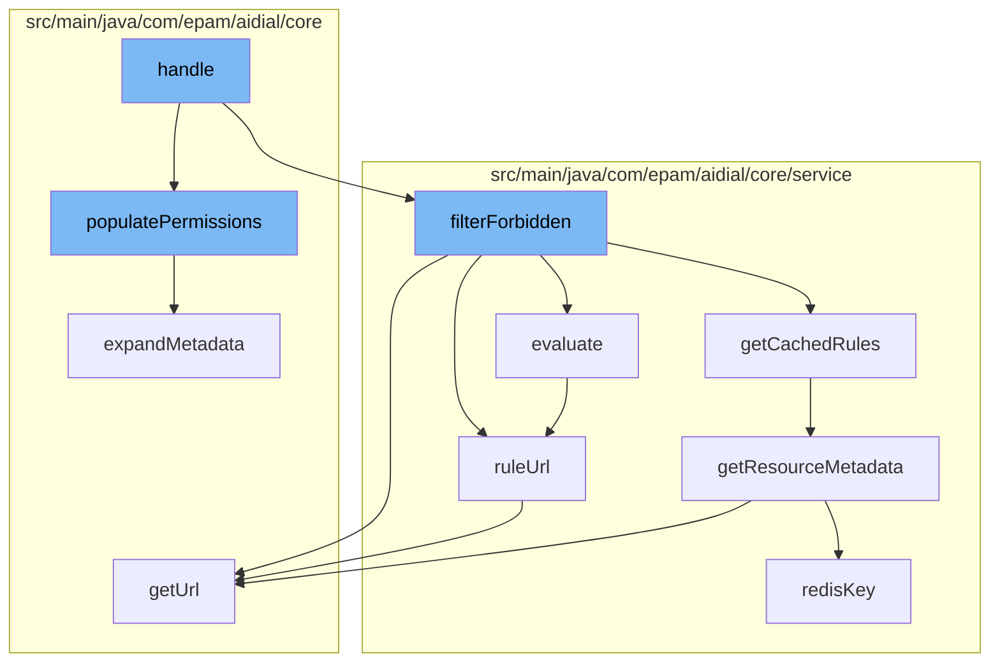

This document will cover the process of handling file metadata in the ai-dial-core-demo project. We'll cover:

1. Populating permissions for metadata
2. Filtering forbidden resources
3. Evaluating access rules
4. Retrieving resource metadata



<SwmSnippet path="/src/main/java/com/epam/aidial/core/security/AccessService.java" line="238">

---

# Populating permissions for metadata

The `populatePermissions` function is the entry point for this flow. It iterates over the metadata collection and calls `expandMetadata` for each item. After expanding the metadata, it looks up the permissions for each resource and sets them in the metadata.

```java
    public void populatePermissions(
            ProxyContext context,
            String bucketLocation,
            Collection<MetadataBase> metadata) {
        Map<ResourceDescription, MetadataBase> allMetadata = new HashMap<>();
        for (MetadataBase meta : metadata) {
            expandMetadata(meta, bucketLocation, allMetadata);
        }

        Map<ResourceDescription, Set<ResourceAccessType>> permissions = lookupPermissions(allMetadata.keySet(), context);
        allMetadata.forEach((resource, meta) -> meta.setPermissions(permissions.get(resource)));
    }
```

---

</SwmSnippet>

<SwmSnippet path="/src/main/java/com/epam/aidial/core/service/RuleService.java" line="145">

---

# Filtering forbidden resources

The `evaluate` function is called within `filterForbidden` to determine if a resource is accessible based on the rules. It recursively checks the rules for the resource and its parent resources. The result is cached for efficiency.

```java
    private static boolean evaluate(ProxyContext context,
                                    ResourceDescription resource,
                                    Map<String, List<Rule>> rules,
                                    Map<String, Boolean> cache) {

        if (resource != null && !resource.isFolder()) {
            resource = resource.getParent();
        }

        if (resource == null) {
            return true;
        }

        String folderUrl = ruleUrl(resource);
        Boolean evaluated = cache.get(folderUrl);

        if (evaluated != null) {
            return evaluated;
        }

        evaluated = evaluate(context, resource.getParent(), rules, cache);
```

---

</SwmSnippet>

<SwmSnippet path="/src/main/java/com/epam/aidial/core/service/ResourceService.java" line="160">

---

# Retrieving resource metadata

The `getResourceMetadata` function retrieves the metadata for a resource. It first checks the Redis cache, and if not found, it retrieves the metadata from the blob storage.

```java
    @Nullable
    public ResourceItemMetadata getResourceMetadata(ResourceDescription descriptor) {
        if (descriptor.isFolder()) {
            throw new IllegalArgumentException("Resource folder: " + descriptor.getUrl());
        }

        String redisKey = redisKey(descriptor);
        String blobKey = blobKey(descriptor);
        Result result = redisGet(redisKey, false);

        if (result == null) {
            result = blobGet(blobKey, false);
        }

        if (!result.exists) {
            return null;
        }

        return new ResourceItemMetadata(descriptor)
                .setCreatedAt(result.createdAt)
                .setUpdatedAt(result.updatedAt);
```

---

</SwmSnippet>

&nbsp;

*This is an auto-generated document by Swimm AI 🌊 and has not yet been verified by a human*

<SwmMeta version="3.0.0" repo-id="Z2l0aHViJTNBJTNBYWktZGlhbC1jb3JlLWRlbW8lM0ElM0FTd2ltbS1EZW1v" repo-name="ai-dial-core-demo" doc-type="flows"><sup>Powered by [Swimm](/)</sup></SwmMeta>
