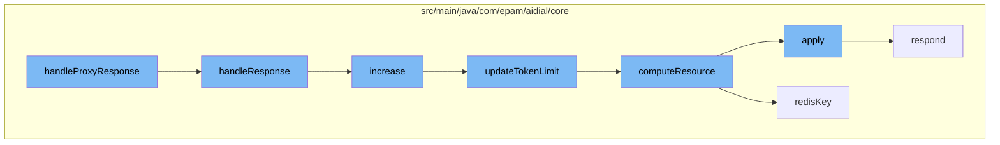

This document will cover the process of handling proxy responses in the ai-dial-core-demo project. We'll cover:

1. The initiation of the process with the function `handleProxyResponse`
2. The rate limiting mechanism
3. The resource computation and attachment collection
4. The final response to the client.



<SwmSnippet path="/src/main/java/com/epam/aidial/core/controller/DeploymentPostController.java" line="336">

---

# Initiation of the process

The function `handleProxyResponse` is the entry point of the process. It is responsible for handling the response from the proxy sent from the origin to the client. It sets the response body and timestamp, and initiates the token usage tracking.

```java
    /**
     * Called when proxy sent response from the origin to the client.
     */
    @VisibleForTesting
    void handleResponse() {
        Buffer responseBody = context.getResponseStream().getContent();
        context.setResponseBody(responseBody);
        context.setResponseBodyTimestamp(System.currentTimeMillis());
        Future<TokenUsage> tokenUsageFuture = Future.succeededFuture();
        if (context.getDeployment() instanceof Model model) {
            if (context.getResponse().getStatusCode() == HttpStatus.OK.getCode()) {
                TokenUsage tokenUsage = TokenUsageParser.parse(responseBody);
                if (tokenUsage == null) {
                    Pricing pricing = model.getPricing();
                    if (pricing == null || "token".equals(pricing.getUnit())) {
                        log.warn("Can't find token usage. Trace: {}. Span: {}. Key: {}. Deployment: {}. Endpoint: {}. Upstream: {}. Status: {}. Length: {}",
                                context.getTraceId(), context.getSpanId(),
                                context.getProject(), context.getDeployment().getName(),
                                context.getDeployment().getEndpoint(),
                                context.getUpstreamRoute().get().getEndpoint(),
                                context.getResponse().getStatusCode(),
```

---

</SwmSnippet>

<SwmSnippet path="/src/main/java/com/epam/aidial/core/limiter/RateLimiter.java" line="36">

---

# Rate limiting mechanism

The `increase` function in the `RateLimiter` class is called to update the token limit based on the token usage. If the token usage is null or zero, the function returns without making any changes.

```java
    public Future<Void> increase(ProxyContext context) {
        try {
            // skip checking limits if redis is not available
            if (resourceService == null) {
                return Future.succeededFuture();
            }

            TokenUsage usage = context.getTokenUsage();

            if (usage == null || usage.getTotalTokens() <= 0) {
                return Future.succeededFuture();
            }

            String tokensPath = getPathToTokens(context.getDeployment().getName());
            ResourceDescription resourceDescription = getResourceDescription(context, tokensPath);
            return vertx.executeBlocking(() -> updateTokenLimit(resourceDescription, usage.getTotalTokens()), false);
        } catch (Throwable e) {
            return Future.failedFuture(e);
        }
    }
```

---

</SwmSnippet>

<SwmSnippet path="/src/main/java/com/epam/aidial/core/service/ResourceService.java" line="270">

---

# Resource computation and attachment collection

The `computeResource` function in the `ResourceService` class is called to compute the resource based on the resource description. It locks the resource, gets the old body, applies the function to get the new body, and updates the resource if the body has changed.

```java
    public void computeResource(ResourceDescription descriptor, Function<String, String> fn) {
        String redisKey = redisKey(descriptor);

        try (var ignore = lockService.lock(redisKey)) {
            String oldBody = getResource(descriptor, false);
            String newBody = fn.apply(oldBody);
            if (newBody != null) {
                // update resource only if body changed
                if (!newBody.equals(oldBody)) {
                    putResource(descriptor, newBody, true, false);
                }
            }
        }
    }
```

---

</SwmSnippet>

<SwmSnippet path="/src/main/java/com/epam/aidial/core/Proxy.java" line="214">

---

# Final response to the client

Finally, the `respond` function in the `Proxy` class is called to send the response to the client.

```java
    private void respond(HttpServerRequest request, HttpStatus status) {
        request.response().setStatusCode(status.getCode()).end();
    }
```

---

</SwmSnippet>

&nbsp;

*This is an auto-generated document by Swimm AI 🌊 and has not yet been verified by a human*

<SwmMeta version="3.0.0" repo-id="Z2l0aHViJTNBJTNBYWktZGlhbC1jb3JlLWRlbW8lM0ElM0FTd2ltbS1EZW1v" repo-name="ai-dial-core-demo" doc-type="flows"><sup>Powered by [Swimm](/)</sup></SwmMeta>
