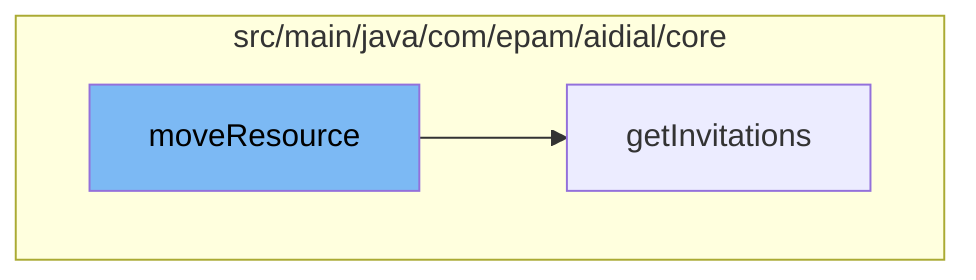

This document will cover the process of handling invitations in the ai-dial-core-demo project. We'll cover:

1. The initiation of the process with the `moveResource` function.
2. The retrieval of invitations with the `getInvitations` function.



<SwmSnippet path="/src/main/java/com/epam/aidial/core/service/InvitationService.java" line="1">

---

# The initiation of the process with the `moveResource` function

The `moveResource` function in `InvitationService.java` is the starting point of the invitation handling process. It calls the `getInvitations` function in `InvitationController.java` to retrieve the invitations.

```java
package com.epam.aidial.core.service;
```

---

</SwmSnippet>

<SwmSnippet path="/src/main/java/com/epam/aidial/core/controller/InvitationController.java" line="34">

---

# The retrieval of invitations with the `getInvitations` function

The `getInvitations` function retrieves the invitations. It first builds the bucket location and encrypts it. Then, it calls the `getMyInvitations` function in `InvitationService` to get the invitations for the bucket. The result is then sent as a response. In case of an error, an internal server error response is sent.

```java
    public Future<?> getInvitations() {
        proxy.getVertx()
                .executeBlocking(() -> {
                    String bucketLocation = BlobStorageUtil.buildInitiatorBucket(context);
                    String bucket = encryptionService.encrypt(bucketLocation);
                    return invitationService.getMyInvitations(bucket, bucketLocation);
                }, false)
                .onSuccess(response -> context.respond(HttpStatus.OK, response))
                .onFailure(error -> context.respond(HttpStatus.INTERNAL_SERVER_ERROR, error.getMessage()));
        return Future.succeededFuture();
    }
```

---

</SwmSnippet>

&nbsp;

*This is an auto-generated document by Swimm AI 🌊 and has not yet been verified by a human*

<SwmMeta version="3.0.0" repo-id="Z2l0aHViJTNBJTNBYWktZGlhbC1jb3JlLWRlbW8lM0ElM0FTd2ltbS1EZW1v" repo-name="ai-dial-core-demo" doc-type="flows"><sup>Powered by [Swimm](/)</sup></SwmMeta>
