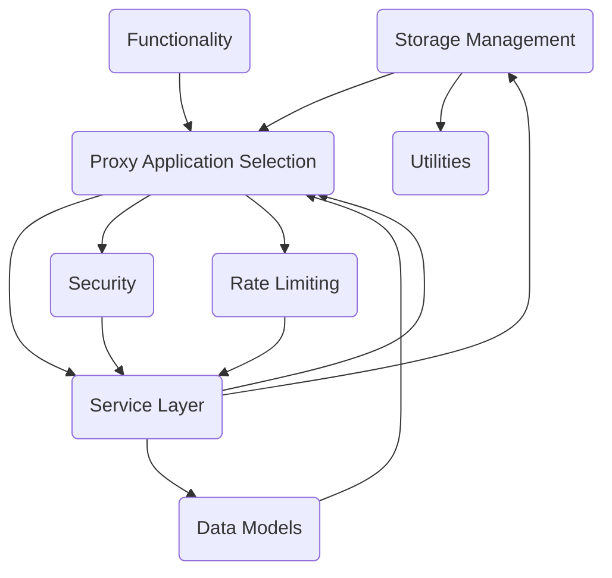

The ai-dial-core-demo is a HTTP Proxy that provides a unified API to different chat completion and embedding models, assistants, and applications. It's written in Java 17 and built on top of Eclipse Vert.x. The project can be built with Gradle and Java 17, and can be run with Gradle or from your favorite IDE. It can be deployed on a Kubernetes cluster using Helm charts. The project supports various storage options including AWS S3, Google Cloud Storage, and Azure Blob Store.

## Main Components

### Data Models

Data models are structured representations of data, defining the data elements and their relationships. They ensure consistency, efficiency, and accuracy in data handling within a software system.

- <SwmLink doc-title="Data models overview">[Data models overview](.swm/data-models-overview.pp6bsop3.sw.md)</SwmLink>
- <SwmLink doc-title="The deploymentdata class">[The deploymentdata class](.swm/the-deploymentdata-class.8iut8.sw.md)</SwmLink>

### Service Layer

The Service Layer is a crucial part of the application architecture, providing a bridge between the data access layer and the client, encapsulating the core business logic of the application.

- <SwmLink doc-title="Service layer overview">[Service layer overview](.swm/service-layer-overview.c0j4qtql.sw.md)</SwmLink>
- <SwmLink doc-title="Basic concepts of resource sharing service">[Basic concepts of resource sharing service](.swm/basic-concepts-of-resource-sharing-service.jas5e3s5.sw.md)</SwmLink>
- <SwmLink doc-title="Getting started with publication management service">[Getting started with publication management service](.swm/getting-started-with-publication-management-service.gn6bqfup.sw.md)</SwmLink>
- **Flows**
  - <SwmLink doc-title="Shared resources management">[Shared resources management](.swm/shared-resources-management.mhhbyqnx.sw.md)</SwmLink>
  - <SwmLink doc-title="Resource deletion process">[Resource deletion process](.swm/resource-deletion-process.9ycxjdp4.sw.md)</SwmLink>
  - <SwmLink doc-title="Resource moving process">[Resource moving process](.swm/resource-moving-process.9l3iuv9a.sw.md)</SwmLink>
  - <SwmLink doc-title="File deletion process">[File deletion process](.swm/file-deletion-process.8qj9tszf.sw.md)</SwmLink>

### Controllers

Controllers are key components in handling and managing HTTP requests and responses in the application. They perform operations based on the request and send back the appropriate responses.

- <SwmLink doc-title="Http controllers overview">[Http controllers overview](.swm/http-controllers-overview.i62rdkr1.sw.md)</SwmLink>
- <SwmLink doc-title="What is deployment post request handling">[What is deployment post request handling](.swm/what-is-deployment-post-request-handling.ley49ai9.sw.md)</SwmLink>
- **Flows**
  - <SwmLink doc-title="Deployment post request handling">[Deployment post request handling](.swm/deployment-post-request-handling.lwnipue6.sw.md)</SwmLink>
  - <SwmLink doc-title="Handling proxy responses process">[Handling proxy responses process](.swm/handling-proxy-responses-process.ufencvr6.sw.md)</SwmLink>

### Storage Management

Storage management in ai-dial-core-demo refers to the functionality that allows the system to interact with different storage providers. It includes the ability to define the storage provider, handle storage paths, and perform operations such as initializing multipart uploads, storing parts of a file, and completing or aborting multipart uploads. The system supports various storage providers such as AWS S3, Google Cloud Storage, and Azure Blob Store, and it can switch between them based on the provided storage provider name.

- <SwmLink doc-title="Data storage management overview">[Data storage management overview](.swm/data-storage-management-overview.rbps53l8.sw.md)</SwmLink>
- <SwmLink doc-title="The credentialprovider class">[The credentialprovider class](.swm/the-credentialprovider-class.oswjv.sw.md)</SwmLink>
- **Flows**
  - <SwmLink doc-title="File metadata handling">[File metadata handling](.swm/file-metadata-handling.ut4sd95s.sw.md)</SwmLink>
  - <SwmLink doc-title="Process of rejecting a publication">[Process of rejecting a publication](.swm/process-of-rejecting-a-publication.7mchw79o.sw.md)</SwmLink>
  - <SwmLink doc-title="Publication deletion process">[Publication deletion process](.swm/publication-deletion-process.3e574wf7.sw.md)</SwmLink>

### Functionality

Functionality refers to the operations and tasks that the code can perform. It is implemented through the use of functions encapsulated in classes, which are then used throughout the codebase to perform specific tasks.

- <SwmLink doc-title="Functional operations overview">[Functional operations overview](.swm/functional-operations-overview.z6x980gv.sw.md)</SwmLink>
- <SwmLink doc-title="The basefunction class">[The basefunction class](.swm/the-basefunction-class.ue87e.sw.md)</SwmLink>

### Security

Security in ai-dial-core-demo is a comprehensive system that ensures data integrity and confidentiality. It involves encryption, identity verification, and access control mechanisms.

- <SwmLink doc-title="Security overview">[Security overview](.swm/security-overview.irj67o5y.sw.md)</SwmLink>
- <SwmLink doc-title="Getting started with identity management">[Getting started with identity management](.swm/getting-started-with-identity-management.g2ovaxkq.sw.md)</SwmLink>

### Rate Limiting

Rate limiting is a technique used to control the rate of requests a system processes, preventing potential overload. It is implemented in the ai-dial-core-demo repository using the RateLimiter class, which manages the rate limits for requests and tokens.

- <SwmLink doc-title="Rate limiting overview">[Rate limiting overview](.swm/rate-limiting-overview.92pwav0h.sw.md)</SwmLink>

### Utilities

Utilities are sets of static methods that perform common tasks throughout the application. They help in reducing code redundancy and improving code readability.

- <SwmLink doc-title="Utility classes overview">[Utility classes overview](.swm/utility-classes-overview.jdgl7x6g.sw.md)</SwmLink>

### Proxy Application Selection

Proxy Application Selection refers to the process of choosing the appropriate application to handle a specific request in the HTTP Proxy. This is achieved through the use of patterns that match the request path to a specific application. The selection process is handled by the 'select' method in the 'ControllerSelector' class, which uses the HTTP method (GET, POST, DELETE, PUT) of the request to determine the appropriate selection method to use. Each selection method (selectGet, selectPost, selectDelete, selectPut) uses different patterns to match the request path to a specific application and returns a controller that can handle the request. If no match is found, a default 'RouteController' is returned.

- <SwmLink doc-title="Application proxy selection overview">[Application proxy selection overview](.swm/application-proxy-selection-overview.v9gjkiya.sw.md)</SwmLink>
- <SwmLink doc-title="Exploring application selection in controller selector">[Exploring application selection in controller selector](.swm/exploring-application-selection-in-controller-selector.2twc021s.sw.md)</SwmLink>
- <SwmLink doc-title="Introduction to application selection in application service">[Introduction to application selection in application service](.swm/introduction-to-application-selection-in-application-service.8rmnnm1m.sw.md)</SwmLink>

### Proxy Application Handling

Proxy application handling in this context refers to the process of managing and routing HTTP requests to the appropriate services or applications. This is achieved through various controllers and services that handle different types of requests, such as GET, POST, DELETE, and PUT. The controllers select the appropriate route based on the request type and context, and then handle the request accordingly. This includes copying headers, handling proxy requests, and managing access control. The proxy application also handles errors and exceptions, ensuring that the appropriate HTTP status codes and messages are returned.

- <SwmLink doc-title="Proxy application handling overview">[Proxy application handling overview](.swm/proxy-application-handling-overview.k95qas1w.sw.md)</SwmLink>
- <SwmLink doc-title="What is applicationcontroller proxy handling">[What is applicationcontroller proxy handling](.swm/what-is-applicationcontroller-proxy-handling.s7qnz90k.sw.md)</SwmLink>
- <SwmLink doc-title="Exploring proxy application management in custom application service">[Exploring proxy application management in custom application service](.swm/exploring-proxy-application-management-in-custom-application-service.o3mmg8n8.sw.md)</SwmLink>

### Proxy Application Selection

Proxy Application Selection refers to the process of choosing the appropriate application to handle a specific request in the ai-dial-core-demo repository. This is achieved through the use of the 'select' method in the 'ControllerSelector' class, which uses HTTP methods (GET, POST, DELETE, PUT) and URL patterns to determine the appropriate controller for handling the request. The selected controller then performs the necessary operations, such as fetching or modifying data.

- <SwmLink doc-title="Application proxy selection overview">[Application proxy selection overview](.swm/application-proxy-selection-overview.rih5s7ix.sw.md)</SwmLink>
- <SwmLink doc-title="Getting started with application controller selection">[Getting started with application controller selection](.swm/getting-started-with-application-controller-selection.aztx8rzf.sw.md)</SwmLink>
- <SwmLink doc-title="Basic concepts of application selection in custom application service">[Basic concepts of application selection in custom application service](.swm/basic-concepts-of-application-selection-in-custom-application-service.971211ad.sw.md)</SwmLink>
- <SwmLink doc-title="The accesscontrolbasecontroller class">[The accesscontrolbasecontroller class](.swm/the-accesscontrolbasecontroller-class.98qx3.sw.md)</SwmLink>
- **Flows**
  - <SwmLink doc-title="Http request handling">[Http request handling](.swm/http-request-handling.9iku5506.sw.md)</SwmLink>
  - <SwmLink doc-title="Http request and response handling">[Http request and response handling](.swm/http-request-and-response-handling.h9r766ti.sw.md)</SwmLink>
  - <SwmLink doc-title="Data handling process">[Data handling process](.swm/data-handling-process.9pposiua.sw.md)</SwmLink>

### Flows

- <SwmLink doc-title="Http request handling process">[Http request handling process](.swm/http-request-handling-process.djccj1jx.sw.md)</SwmLink>
- <SwmLink doc-title="Publication creation process">[Publication creation process](.swm/publication-creation-process.purg8eul.sw.md)</SwmLink>
- <SwmLink doc-title="Deployment feature handling">[Deployment feature handling](.swm/deployment-feature-handling.847uttvl.sw.md)</SwmLink>
- <SwmLink doc-title="Enhancement and response flow">[Enhancement and response flow](.swm/enhancement-and-response-flow.lz4xzha5.sw.md)</SwmLink>
- <SwmLink doc-title="Deployment handling process">[Deployment handling process](.swm/deployment-handling-process.hl9yljo3.sw.md)</SwmLink>
- <SwmLink doc-title="Invitation handling process">[Invitation handling process](.swm/invitation-handling-process.jb64n8vn.sw.md)</SwmLink>
- <SwmLink doc-title="Public resource access process">[Public resource access process](.swm/public-resource-access-process.9bf5mbjl.sw.md)</SwmLink>

## Classes

- <SwmLink doc-title="The deployment class">[The deployment class](.swm/the-deployment-class.nixty.sw.md)</SwmLink>

## Build Tools

- <SwmLink doc-title="Gradle configuration and execution in the project">[Gradle configuration and execution in the project](.swm/gradle-configuration-and-execution-in-the-project.0rbqg39u.sw.md)</SwmLink>
- <SwmLink doc-title="Building the project with docker">[Building the project with docker](.swm/building-the-project-with-docker.1q5g3y5h.sw.md)</SwmLink>

&nbsp;

*This is an auto-generated document by Swimm AI 🌊 and has not yet been verified by a human*

<SwmMeta version="3.0.0" repo-id="Z2l0aHViJTNBJTNBYWktZGlhbC1jb3JlLWRlbW8lM0ElM0FTd2ltbS1EZW1v" repo-name="ai-dial-core-demo" doc-type="other">Powered by [Swimm](/)</SwmMeta>
