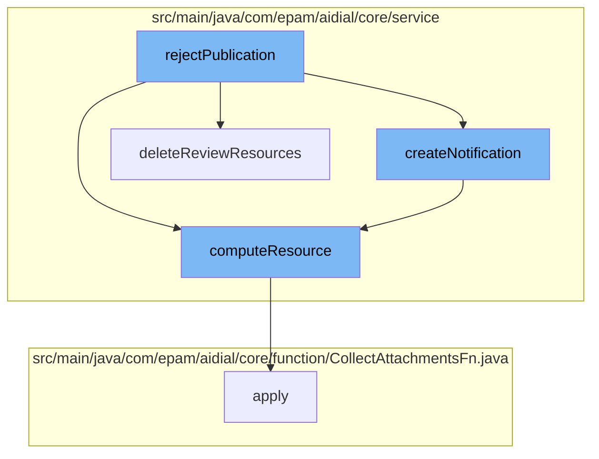

This document will cover the process of rejecting a publication in the ai-dial-core-demo project. The process includes the following steps:

1. The initiation of the rejection process
2. The creation of a notification
3. The computation of resources
4. The deletion of review resources.



<SwmSnippet path="/src/main/java/com/epam/aidial/core/service/PublicationService.java" line="1">

---

# Initiation of the Rejection Process

The rejection process begins with the `rejectPublication` function. This function is responsible for initiating the process of rejecting a publication.

```java
package com.epam.aidial.core.service;
```

---

</SwmSnippet>

<SwmSnippet path="/src/main/java/com/epam/aidial/core/service/NotificationService.java" line="34">

---

# Creation of a Notification

The `createNotification` function is called next. This function is responsible for creating a notification about the rejection of the publication.

```java
    public Notification createNotification(String bucketName, String bucketLocation, Notification notification) {
        ResourceDescription notificationResource = getNotificationResource(bucketName, bucketLocation);

        resourceService.computeResource(notificationResource, body -> {
            Map<String, Notification> notifications = decodeNotifications(body);
            notifications.put(notification.getId(), notification);

            return ProxyUtil.convertToString(notifications);
        });

        return notification;
    }
```

---

</SwmSnippet>

<SwmSnippet path="/src/main/java/com/epam/aidial/core/service/ResourceService.java" line="270">

---

# Computation of Resources

The `computeResource` function is then called. This function is responsible for computing the resources related to the publication that is being rejected.

```java
    public void computeResource(ResourceDescription descriptor, Function<String, String> fn) {
        String redisKey = redisKey(descriptor);

        try (var ignore = lockService.lock(redisKey)) {
            String oldBody = getResource(descriptor, false);
            String newBody = fn.apply(oldBody);
            if (newBody != null) {
                // update resource only if body changed
                if (!newBody.equals(oldBody)) {
                    putResource(descriptor, newBody, true, false);
                }
            }
        }
    }
```

---

</SwmSnippet>

<SwmSnippet path="/src/main/java/com/epam/aidial/core/service/PublicationService.java" line="1">

---

# Deletion of Review Resources

Finally, the `deleteReviewResources` function is called. This function is responsible for deleting the resources related to the review of the publication that is being rejected.

```java
package com.epam.aidial.core.service;
```

---

</SwmSnippet>

&nbsp;

*This is an auto-generated document by Swimm AI 🌊 and has not yet been verified by a human*

<SwmMeta version="3.0.0" repo-id="Z2l0aHViJTNBJTNBYWktZGlhbC1jb3JlLWRlbW8lM0ElM0FTd2ltbS1EZW1v" repo-name="ai-dial-core-demo" doc-type="flows"><sup>Powered by [Swimm](/)</sup></SwmMeta>
