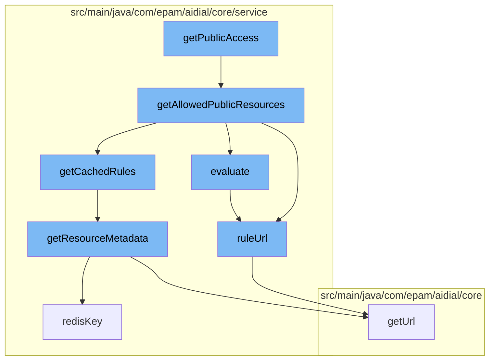

This document will cover the process of getting public access in the ai-dial-core-demo project, which includes:

1. Fetching allowed public resources
2. Evaluating access rules
3. Retrieving resource metadata
4. Constructing resource URLs



<SwmSnippet path="/src/main/java/com/epam/aidial/core/service/RuleService.java" line="86">

---

# Fetching allowed public resources

The function `getAllowedPublicResources` is used to fetch all public resources. It filters out resources that are public and evaluates access rules for each resource.

```java
    public Set<ResourceDescription> getAllowedPublicResources(
            ProxyContext context, Set<ResourceDescription> resources) {
        resources = resources.stream()
                .filter(ResourceDescription::isPublic)
                .collect(Collectors.toUnmodifiableSet());

        if (resources.isEmpty()) {
            return Set.of();
        }

        Map<String, List<Rule>> rules = getCachedRules();
        Map<String, Boolean> cache = new HashMap<>();
        for (ResourceDescription resource : resources) {
            evaluate(context, resource, rules, cache);
        }

        return resources.stream()
                .filter(resource -> {
                    resource = resource.isFolder() ? resource : resource.getParent();
                    return resource == null || cache.get(ruleUrl(resource));
                })
```

---

</SwmSnippet>

<SwmSnippet path="/src/main/java/com/epam/aidial/core/service/RuleService.java" line="145">

---

# Evaluating access rules

The function `evaluate` is used to evaluate access rules for a given resource. It checks if the resource is a folder and retrieves the parent if it's not. It then evaluates the rules for the resource's parent and checks if any rules match the current context.

```java
    private static boolean evaluate(ProxyContext context,
                                    ResourceDescription resource,
                                    Map<String, List<Rule>> rules,
                                    Map<String, Boolean> cache) {

        if (resource != null && !resource.isFolder()) {
            resource = resource.getParent();
        }

        if (resource == null) {
            return true;
        }

        String folderUrl = ruleUrl(resource);
        Boolean evaluated = cache.get(folderUrl);

        if (evaluated != null) {
            return evaluated;
        }

        evaluated = evaluate(context, resource.getParent(), rules, cache);
```

---

</SwmSnippet>

<SwmSnippet path="/src/main/java/com/epam/aidial/core/service/ResourceService.java" line="160">

---

# Retrieving resource metadata

The function `getResourceMetadata` is used to retrieve metadata for a given resource. It checks if the resource is a folder and throws an exception if it is. It then retrieves the metadata from Redis or Blob storage.

```java
    @Nullable
    public ResourceItemMetadata getResourceMetadata(ResourceDescription descriptor) {
        if (descriptor.isFolder()) {
            throw new IllegalArgumentException("Resource folder: " + descriptor.getUrl());
        }

        String redisKey = redisKey(descriptor);
        String blobKey = blobKey(descriptor);
        Result result = redisGet(redisKey, false);

        if (result == null) {
            result = blobGet(blobKey, false);
        }

        if (!result.exists) {
            return null;
        }

        return new ResourceItemMetadata(descriptor)
                .setCreatedAt(result.createdAt)
                .setUpdatedAt(result.updatedAt);
```

---

</SwmSnippet>

<SwmSnippet path="/src/main/java/com/epam/aidial/core/data/ResourceUrl.java" line="21">

---

# Constructing resource URLs

The function `getUrl` is used to construct a URL for a given resource. It iterates over the segments of the resource and encodes each segment. If the resource is a folder, it appends a path separator at the end.

```java
    public String getUrl() {
        StringBuilder builder = new StringBuilder(rawUrl.length());

        for (int i = 0; i < segments.length; i++) {
            if (i > 0) {
                builder.append(BlobStorageUtil.PATH_SEPARATOR);
            }

            builder.append(UrlUtil.encodePath(segments[i]));
        }

        if (folder) {
            builder.append(BlobStorageUtil.PATH_SEPARATOR);
        }

        return builder.toString();
    }
```

---

</SwmSnippet>

&nbsp;

*This is an auto-generated document by Swimm AI 🌊 and has not yet been verified by a human*

<SwmMeta version="3.0.0" repo-id="Z2l0aHViJTNBJTNBYWktZGlhbC1jb3JlLWRlbW8lM0ElM0FTd2ltbS1EZW1v" repo-name="ai-dial-core-demo" doc-type="flows"><sup>Powered by [Swimm](/)</sup></SwmMeta>
