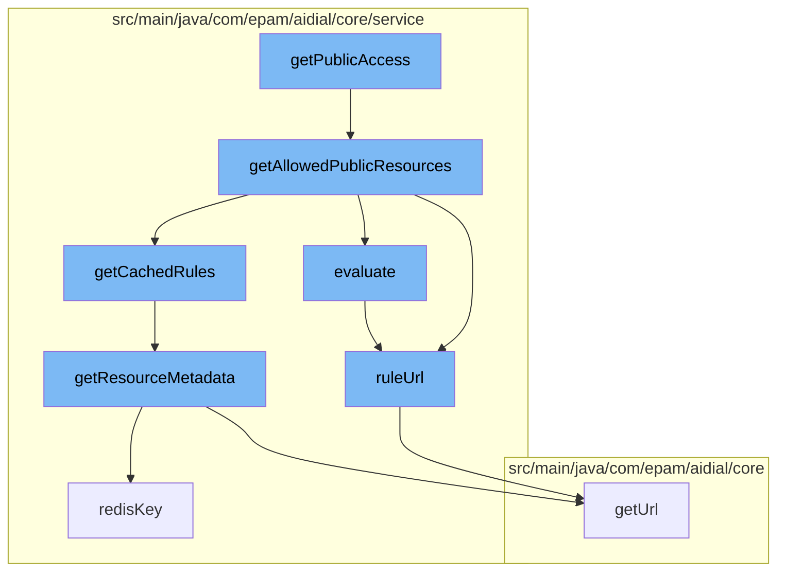

This document will cover the process of accessing public resources in the ai-dial-core-demo project. We'll cover:

1. The initiation of the process by the `getPublicAccess` function.
2. The retrieval of allowed public resources.
3. The evaluation of access rules.
4. The retrieval of resource metadata.



<SwmSnippet path="/src/main/java/com/epam/aidial/core/security/AccessService.java" line="1">

---

# Initiation of the Process

The process begins with the `getPublicAccess` function. This function is responsible for initiating the process of retrieving public resources.

```java
package com.epam.aidial.core.security;
```

---

</SwmSnippet>

<SwmSnippet path="/src/main/java/com/epam/aidial/core/service/RuleService.java" line="86">

---

# Retrieval of Allowed Public Resources

The `getAllowedPublicResources` function is called next. This function filters the resources to only include public ones and then retrieves the rules for these resources from the cache.

```java
    public Set<ResourceDescription> getAllowedPublicResources(
            ProxyContext context, Set<ResourceDescription> resources) {
        resources = resources.stream()
                .filter(ResourceDescription::isPublic)
                .collect(Collectors.toUnmodifiableSet());

        if (resources.isEmpty()) {
            return Set.of();
        }

        Map<String, List<Rule>> rules = getCachedRules();
        Map<String, Boolean> cache = new HashMap<>();
        for (ResourceDescription resource : resources) {
            evaluate(context, resource, rules, cache);
        }

        return resources.stream()
                .filter(resource -> {
                    resource = resource.isFolder() ? resource : resource.getParent();
                    return resource == null || cache.get(ruleUrl(resource));
                })
```

---

</SwmSnippet>

<SwmSnippet path="/src/main/java/com/epam/aidial/core/service/RuleService.java" line="145">

---

# Evaluation of Access Rules

The `evaluate` function is then called to evaluate the access rules for each resource. It checks if the resource is a folder and if so, it retrieves the parent resource. It then retrieves the rules for the resource and evaluates them.

```java
    private static boolean evaluate(ProxyContext context,
                                    ResourceDescription resource,
                                    Map<String, List<Rule>> rules,
                                    Map<String, Boolean> cache) {

        if (resource != null && !resource.isFolder()) {
            resource = resource.getParent();
        }

        if (resource == null) {
            return true;
        }

        String folderUrl = ruleUrl(resource);
        Boolean evaluated = cache.get(folderUrl);

        if (evaluated != null) {
            return evaluated;
        }

        evaluated = evaluate(context, resource.getParent(), rules, cache);
```

---

</SwmSnippet>

<SwmSnippet path="/src/main/java/com/epam/aidial/core/service/ResourceService.java" line="160">

---

# Retrieval of Resource Metadata

Finally, the `getResourceMetadata` function is called to retrieve the metadata for the resource. This includes the creation and update timestamps.

```java
    @Nullable
    public ResourceItemMetadata getResourceMetadata(ResourceDescription descriptor) {
        if (descriptor.isFolder()) {
            throw new IllegalArgumentException("Resource folder: " + descriptor.getUrl());
        }

        String redisKey = redisKey(descriptor);
        String blobKey = blobKey(descriptor);
        Result result = redisGet(redisKey, false);

        if (result == null) {
            result = blobGet(blobKey, false);
        }

        if (!result.exists) {
            return null;
        }

        return new ResourceItemMetadata(descriptor)
                .setCreatedAt(result.createdAt)
                .setUpdatedAt(result.updatedAt);
```

---

</SwmSnippet>

&nbsp;

*This is an auto-generated document by Swimm AI 🌊 and has not yet been verified by a human*

<SwmMeta version="3.0.0" repo-id="Z2l0aHViJTNBJTNBYWktZGlhbC1jb3JlLWRlbW8lM0ElM0FTd2ltbS1EZW1v" repo-name="ai-dial-core-demo" doc-type="flows"><sup>Powered by [Swimm](/)</sup></SwmMeta>
