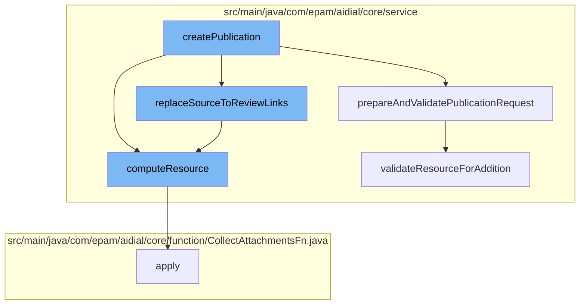

This document will cover the process of creating a publication in the ai-dial-core-demo project. We'll cover:

1. Preparing and validating the publication request
2. Replacing source to review links
3. Computing the resource



<SwmSnippet path="/src/main/java/com/epam/aidial/core/service/PublicationService.java" line="375">

---

# Preparing and validating the publication request

The `validateResourceForAddition` function is used to validate the resource for addition. It checks for permissions, validates the source and target resources, and sets the source, target, and review URLs.

```java
    private void validateResourceForAddition(ProxyContext context, Publication.Resource resource, String targetFolder,
                                             String reviewBucket, Set<String> urls) {
        ResourceDescription source = ResourceDescription.fromPrivateUrl(resource.getSourceUrl(), encryption);
        ResourceDescription target = ResourceDescription.fromPublicUrl(resource.getTargetUrl());

        String sourceUrl = source.getUrl();
        String targetUrl = target.getUrl();

        if (!accessService.hasReadAccess(source, context)) {
            throw new PermissionDeniedException("You don't have permission to access resource " + sourceUrl);
        }

        if (source.isFolder()) {
            throw new IllegalArgumentException("Source resource is folder: " + sourceUrl);
        }

        if (target.isFolder()) {
            throw new IllegalArgumentException("Target resource is folder: " + targetUrl);
        }

        if (!ALLOWED_RESOURCES.contains(source.getType())) {
```

---

</SwmSnippet>

<SwmSnippet path="/src/main/java/com/epam/aidial/core/service/PublicationService.java" line="535">

---

# Replacing source to review links

The `replaceSourceToReviewLinks` function is used to replace the source URLs with review URLs. It collects the links for replacement and then computes the resource for each review conversation and publication.

```java
    private void replaceSourceToReviewLinks(List<Publication.Resource> resources) {
        List<ResourceDescription> reviewConversations = new ArrayList<>();
        List<ResourceDescription> reviewPublications = new ArrayList<>();
        Map<String, String> attachmentsMap = new HashMap<>();
        for (Publication.Resource resource : resources) {
            String sourceUrl = resource.getSourceUrl();
            String reviewUrl = resource.getReviewUrl();

            ResourceDescription from = ResourceDescription.fromPrivateUrl(sourceUrl, encryption);
            ResourceDescription to = ResourceDescription.fromPrivateUrl(reviewUrl, encryption);

            collectLinksForReplacement(reviewConversations, reviewPublications, attachmentsMap, from, to);
        }

        for (ResourceDescription reviewConversation : reviewConversations) {
            this.resources.computeResource(reviewConversation, body ->
                    PublicationUtil.replaceConversationLinks(body, reviewConversation, attachmentsMap)
            );
        }

        for (ResourceDescription reviewPublication : reviewPublications) {
```

---

</SwmSnippet>

<SwmSnippet path="/src/main/java/com/epam/aidial/core/service/ResourceService.java" line="270">

---

# Computing the resource

The `computeResource` function is used to compute the resource. It gets the old body of the resource, applies a function to it to get the new body, and if the new body is different from the old one, it updates the resource.

```java
    public void computeResource(ResourceDescription descriptor, Function<String, String> fn) {
        String redisKey = redisKey(descriptor);

        try (var ignore = lockService.lock(redisKey)) {
            String oldBody = getResource(descriptor, false);
            String newBody = fn.apply(oldBody);
            if (newBody != null) {
                // update resource only if body changed
                if (!newBody.equals(oldBody)) {
                    putResource(descriptor, newBody, true, false);
                }
            }
        }
    }
```

---

</SwmSnippet>

&nbsp;

*This is an auto-generated document by Swimm AI 🌊 and has not yet been verified by a human*

<SwmMeta version="3.0.0" repo-id="Z2l0aHViJTNBJTNBYWktZGlhbC1jb3JlLWRlbW8lM0ElM0FTd2ltbS1EZW1v" repo-name="ai-dial-core-demo" doc-type="flows"><sup>Powered by [Swimm](/)</sup></SwmMeta>
