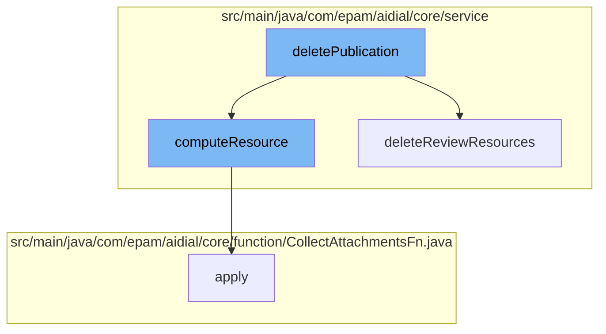

This document will cover the process of deleting a publication in the ai-dial-core-demo project. The process involves the following steps:

1. Invoking the deletePublication function
2. Calling the computeResource function
3. Applying the CollectAttachmentsFn function
4. Deleting review resources associated with the publication.



<SwmSnippet path="/src/main/java/com/epam/aidial/core/service/PublicationService.java" line="1">

---

# Invoking the deletePublication function

The `deletePublication` function is the entry point for the deletion process. It is responsible for initiating the deletion of a publication and its associated resources.

```java
package com.epam.aidial.core.service;

import com.epam.aidial.core.ProxyContext;
import com.epam.aidial.core.data.ListPublishedResourcesRequest;
import com.epam.aidial.core.data.MetadataBase;
import com.epam.aidial.core.data.Notification;
import com.epam.aidial.core.data.Publication;
import com.epam.aidial.core.data.RejectPublicationRequest;
import com.epam.aidial.core.data.ResourceFolderMetadata;
import com.epam.aidial.core.data.ResourceItemMetadata;
```

---

</SwmSnippet>

<SwmSnippet path="/src/main/java/com/epam/aidial/core/service/ResourceService.java" line="270">

---

# Calling the computeResource function

The `computeResource` function is called within `deletePublication`. It is responsible for computing the resources associated with the publication that needs to be deleted. It uses a lock to ensure thread safety during the computation process.

```java
    public void computeResource(ResourceDescription descriptor, Function<String, String> fn) {
        String redisKey = redisKey(descriptor);

        try (var ignore = lockService.lock(redisKey)) {
            String oldBody = getResource(descriptor, false);
            String newBody = fn.apply(oldBody);
            if (newBody != null) {
                // update resource only if body changed
                if (!newBody.equals(oldBody)) {
                    putResource(descriptor, newBody, true, false);
                }
            }
        }
    }
```

---

</SwmSnippet>

<SwmSnippet path="/src/main/java/com/epam/aidial/core/function/CollectAttachmentsFn.java" line="29">

---

# Applying the CollectAttachmentsFn function

The `apply` function in `CollectAttachmentsFn` is called within `computeResource`. It is responsible for collecting and processing the attached files of the publication. It also assigns an API key for each request.

```java
    @Override
    public Throwable apply(ObjectNode tree) {
        try {
            ProxyUtil.collectAttachedFiles(tree, this::processAttachedFile);
            // assign api key data after processing attachments
            ApiKeyData destApiKeyData = context.getProxyApiKeyData();
            proxy.getApiKeyStore().assignPerRequestApiKey(destApiKeyData);
            return null;
        } catch (HttpException e) {
            context.respond(e.getStatus(), e.getMessage());
            log.warn("Can't collect attached files. Trace: {}. Span: {}. Error: {}",
                    context.getTraceId(), context.getSpanId(), e.getMessage());
            return e;
        } catch (Throwable e) {
            context.respond(HttpStatus.BAD_REQUEST);
            log.warn("Can't collect attached files. Trace: {}. Span: {}. Error: {}",
                    context.getTraceId(), context.getSpanId(), e.getMessage());
            return e;
        }
    }
```

---

</SwmSnippet>

<SwmSnippet path="/src/main/java/com/epam/aidial/core/service/PublicationService.java" line="11">

---

# Deleting review resources

After the resources have been computed and the attachments collected, the `deleteReviewResources` function is called to delete the review resources associated with the publication.

```java
import com.epam.aidial.core.data.ResourceType;
import com.epam.aidial.core.data.ResourceUrl;
import com.epam.aidial.core.data.Rule;
import com.epam.aidial.core.security.AccessService;
import com.epam.aidial.core.security.EncryptionService;
import com.epam.aidial.core.storage.BlobStorage;
import com.epam.aidial.core.storage.BlobStorageUtil;
import com.epam.aidial.core.storage.ResourceDescription;
import com.epam.aidial.core.util.ProxyUtil;
import com.epam.aidial.core.util.UrlUtil;
```

---

</SwmSnippet>

&nbsp;

*This is an auto-generated document by Swimm AI 🌊 and has not yet been verified by a human*

<SwmMeta version="3.0.0" repo-id="Z2l0aHViJTNBJTNBYWktZGlhbC1jb3JlLWRlbW8lM0ElM0FTd2ltbS1EZW1v" repo-name="ai-dial-core-demo" doc-type="flows"><sup>Powered by [Swimm](/)</sup></SwmMeta>
