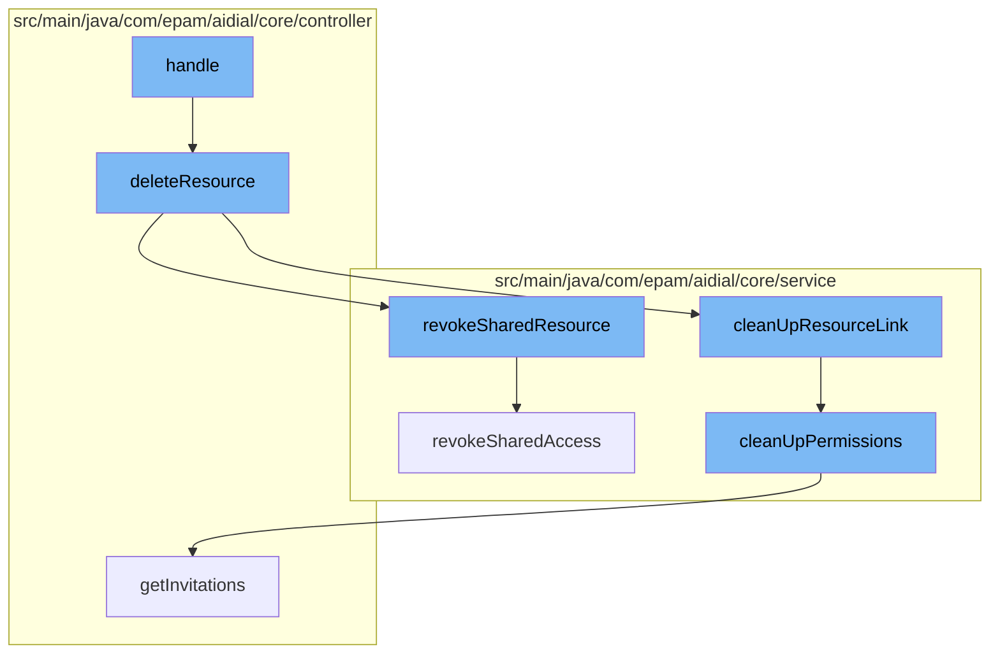

This document will cover the process of deleting a resource in the ai-dial-core-demo project. We'll cover:

1. The initiation of the deletion process
2. Revoking shared access to the resource
3. Cleaning up resource links and permissions
4. Handling the deletion outcome.



<SwmSnippet path="/src/main/java/com/epam/aidial/core/controller/ResourceController.java" line="212">

---

# Initiation of the Deletion Process

The deletion process is initiated by the `deleteResource` function. It first checks if the resource is a folder, and if so, responds with a bad request. If the resource is not a folder, it proceeds to execute the deletion process, which includes cleaning up resource links and revoking shared access to the resource.

```java
    private Future<?> deleteResource(ResourceDescription descriptor) {
        if (descriptor.isFolder()) {
            return context.respond(HttpStatus.BAD_REQUEST, "Folder not allowed: " + descriptor.getUrl());
        }

        return vertx.executeBlocking(() -> {
                    String bucketName = descriptor.getBucketName();
                    String bucketLocation = descriptor.getBucketLocation();
                    return lockService.underBucketLock(bucketLocation, () -> {
                        invitationService.cleanUpResourceLink(bucketName, bucketLocation, descriptor);
                        shareService.revokeSharedResource(bucketName, bucketLocation, descriptor);
                        return service.deleteResource(descriptor);
                    });
                }, false)
                .onSuccess(deleted -> {
                    if (deleted) {
                        context.respond(HttpStatus.OK);
                    } else {
                        context.respond(HttpStatus.NOT_FOUND, "Not found: " + descriptor.getUrl());
                    }
                })
```

---

</SwmSnippet>

<SwmSnippet path="/src/main/java/com/epam/aidial/core/service/ShareService.java" line="254">

---

# Revoking Shared Access to the Resource

The `revokeSharedResource` function is called to revoke shared access to the resource. It calls the `revokeSharedAccess` function, which handles the actual revocation of access.

```java
    public void revokeSharedResource(
            String bucket, String location, ResourceDescription resourceLink) {
        revokeSharedAccess(bucket, location, Map.of(resourceLink, ResourceAccessType.ALL));
    }
```

---

</SwmSnippet>

<SwmSnippet path="/src/main/java/com/epam/aidial/core/service/InvitationService.java" line="134">

---

# Cleaning Up Resource Links and Permissions

The `cleanUpPermissions` function is called to clean up the permissions associated with the resource. It retrieves the invitations associated with the resource and removes the permissions that are no longer needed.

```java
    public void cleanUpPermissions(
            String bucket, String location, Map<ResourceDescription, Set<ResourceAccessType>> permissionsToCleanUp) {
        ResourceDescription resource = ResourceDescription.fromDecoded(ResourceType.INVITATION, bucket, location, INVITATION_RESOURCE_FILENAME);
        resourceService.computeResource(resource, state -> {
            InvitationsMap invitations = ProxyUtil.convertToObject(state, InvitationsMap.class);
            if (invitations == null) {
                return null;
            }
            Map<String, Invitation> invitationMap = invitations.getInvitations();
            List<String> invitationsToRemove = new ArrayList<>();
            Map<String, Set<ResourceAccessType>> linkToPermissions = permissionsToCleanUp.keySet().stream()
                    .collect(Collectors.toUnmodifiableMap(ResourceDescription::getUrl, permissionsToCleanUp::get));
            for (Invitation invitation : invitationMap.values()) {
                List<SharedResource> updatedResources = new ArrayList<>();
                for (SharedResource sharedResource : invitation.getResources()) {
                    Set<ResourceAccessType> permissions = linkToPermissions.get(sharedResource.url());
                    if (permissions == null) {
                        updatedResources.add(sharedResource);
                    } else {
                        sharedResource.permissions().removeAll(permissions);
                        if (!sharedResource.permissions().isEmpty()) {
```

---

</SwmSnippet>

<SwmSnippet path="/src/main/java/com/epam/aidial/core/controller/ResourceController.java" line="226">

---

# Handling the Deletion Outcome

After the deletion process, the function checks if the deletion was successful. If it was, it responds with an OK status. If the resource was not found, it responds with a NOT FOUND status. If there was an error during the deletion process, it logs the error and responds with an INTERNAL SERVER ERROR status.

```java
                .onSuccess(deleted -> {
                    if (deleted) {
                        context.respond(HttpStatus.OK);
                    } else {
                        context.respond(HttpStatus.NOT_FOUND, "Not found: " + descriptor.getUrl());
                    }
                })
                .onFailure(error -> {
                    log.warn("Can't delete resource: {}", descriptor.getUrl(), error);
                    context.respond(HttpStatus.INTERNAL_SERVER_ERROR);
                });
```

---

</SwmSnippet>

&nbsp;

*This is an auto-generated document by Swimm AI 🌊 and has not yet been verified by a human*

<SwmMeta version="3.0.0" repo-id="Z2l0aHViJTNBJTNBYWktZGlhbC1jb3JlLWRlbW8lM0ElM0FTd2ltbS1EZW1v" repo-name="ai-dial-core-demo" doc-type="flows"><sup>Powered by [Swimm](/)</sup></SwmMeta>
