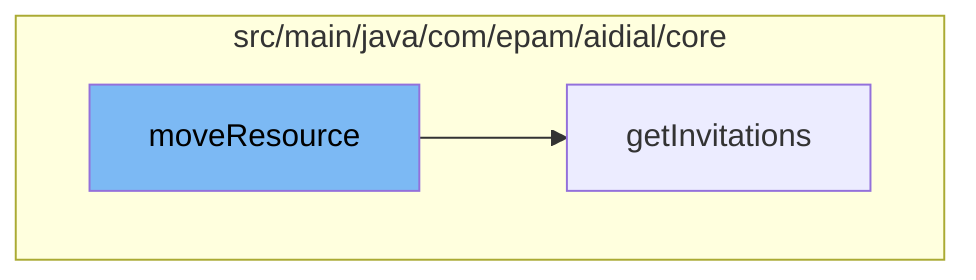

This document will cover the process of moving resources in the ai-dial-core-demo project. We'll cover:

1. The initiation of the resource movement
2. The retrieval of invitations
3. The response handling.



<SwmSnippet path="/src/main/java/com/epam/aidial/core/service/InvitationService.java" line="1">

---

# Initiation of the resource movement

The `moveResource` function in `InvitationService.java` initiates the process of moving resources. This is the starting point of the flow.

```java
package com.epam.aidial.core.service;
```

---

</SwmSnippet>

<SwmSnippet path="/src/main/java/com/epam/aidial/core/controller/InvitationController.java" line="34">

---

# Retrieval of invitations

The `getInvitations` function in `InvitationController.java` is called by `moveResource`. It retrieves the invitations for the current user from the invitation service.

```java
    public Future<?> getInvitations() {
        proxy.getVertx()
                .executeBlocking(() -> {
                    String bucketLocation = BlobStorageUtil.buildInitiatorBucket(context);
                    String bucket = encryptionService.encrypt(bucketLocation);
                    return invitationService.getMyInvitations(bucket, bucketLocation);
```

---

</SwmSnippet>

<SwmSnippet path="/src/main/java/com/epam/aidial/core/controller/InvitationController.java" line="41">

---

# Response handling

The response from `getInvitations` is handled here. On success, it responds with HTTP status OK and the response data. On failure, it responds with HTTP status INTERNAL_SERVER_ERROR and the error message.

```java
                .onSuccess(response -> context.respond(HttpStatus.OK, response))
                .onFailure(error -> context.respond(HttpStatus.INTERNAL_SERVER_ERROR, error.getMessage()));
```

---

</SwmSnippet>

&nbsp;

*This is an auto-generated document by Swimm AI 🌊 and has not yet been verified by a human*

<SwmMeta version="3.0.0" repo-id="Z2l0aHViJTNBJTNBYWktZGlhbC1jb3JlLWRlbW8lM0ElM0FTd2ltbS1EZW1v" repo-name="ai-dial-core-demo" doc-type="flows"><sup>Powered by [Swimm](/)</sup></SwmMeta>
