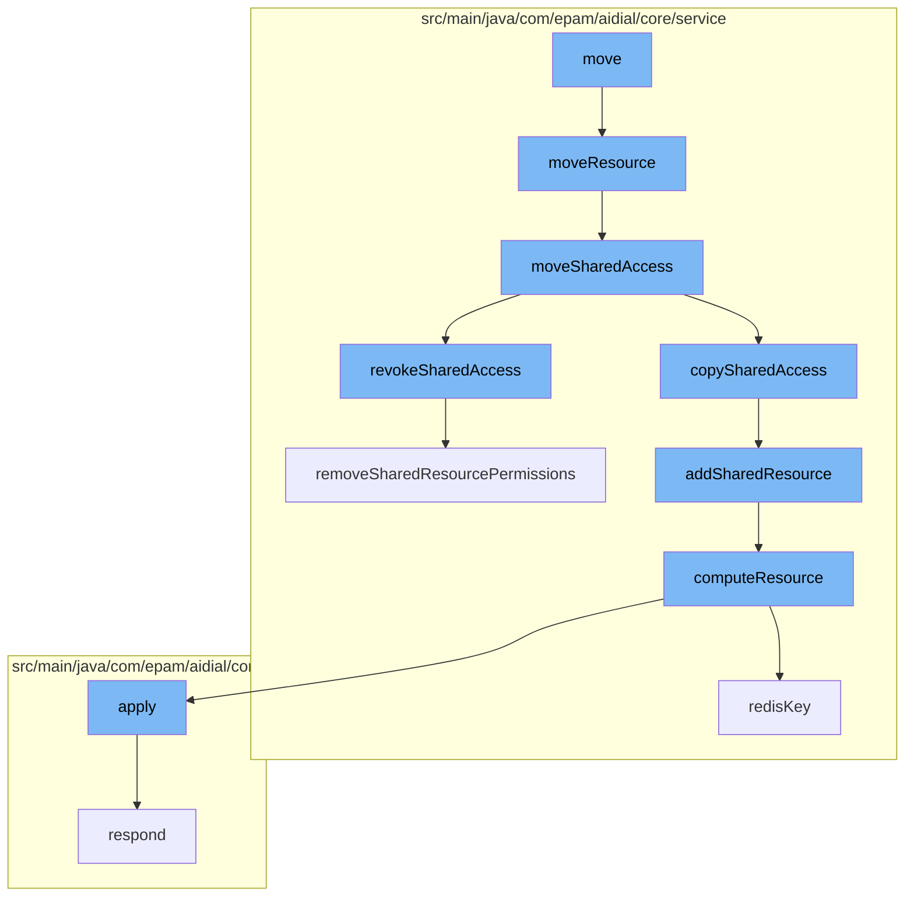

This document will cover the process of moving resources in the ai-dial-core-demo project. We'll cover:

1. The initiation of the resource move process
2. The copying of shared access from source to destination
3. The revoking of shared access from the source
4. The addition of shared resources
5. The computation of resources
6. The removal of shared resource permissions.



<SwmSnippet path="/src/main/java/com/epam/aidial/core/service/ResourceOperationService.java" line="17">

---

# The initiation of the resource move process

The `moveResource` function in `ResourceOperationService` is the entry point for the resource moving process. It checks if the source and destination are valid, copies the resource from the source to the destination, and then deletes the source resource.

```java
    public void moveResource(String bucket, String location, ResourceDescription source, ResourceDescription destination, boolean overwriteIfExists) {
        if (source.isFolder() || destination.isFolder()) {
            throw new IllegalArgumentException("Moving folders is not supported");
        }

        String sourceResourcePath = source.getAbsoluteFilePath();
        String sourceResourceUrl = source.getUrl();
        String destinationResourcePath = destination.getAbsoluteFilePath();
        String destinationResourceUrl = destination.getUrl();

        if (!hasResource(source)) {
            throw new IllegalArgumentException("Source resource %s do not exists".formatted(sourceResourceUrl));
        }

        ResourceType resourceType = source.getType();
        switch (resourceType) {
            case FILE -> {
                if (!overwriteIfExists && storage.exists(destinationResourcePath)) {
                    throw new IllegalArgumentException("Can't move resource %s to %s, because destination resource already exists"
                            .formatted(sourceResourceUrl, destinationResourceUrl));
                }
```

---

</SwmSnippet>

<SwmSnippet path="/src/main/java/com/epam/aidial/core/service/ShareService.java" line="384">

---

# The copying of shared access from source to destination

The `moveSharedAccess` function in `ShareService` is responsible for copying shared access from the source to the destination. It calls the `copySharedAccess` function to copy the shared access and the `revokeSharedAccess` function to revoke the shared access from the source.

```java
    public void moveSharedAccess(String bucket, String location, ResourceDescription source, ResourceDescription destination) {
        // copy shared access from source to destination
        copySharedAccess(bucket, location, source, destination);
        // revoke shared access from source
        revokeSharedAccess(bucket, location, Map.of(source, ResourceAccessType.ALL));
    }
```

---

</SwmSnippet>

<SwmSnippet path="/src/main/java/com/epam/aidial/core/service/ShareService.java" line="259">

---

# The revoking of shared access from the source

The `revokeSharedAccess` function in `ShareService` revokes the shared access from the source. It validates that all resources belong to the user who performs this action and removes the shared resource permissions.

```java
    /**
     * Revoke share access for provided resources. Only resource owner can perform this operation
     *
     * @param bucket - user bucket
     * @param location - storage location
     * @param permissionsToRevoke - collection of resources and permissions to revoke access
     */
    public void revokeSharedAccess(
            String bucket, String location, Map<ResourceDescription, Set<ResourceAccessType>> permissionsToRevoke) {
        if (permissionsToRevoke.isEmpty()) {
            throw new IllegalArgumentException("No resources provided");
        }

        // validate that all resources belong to the user, who perform this action
        permissionsToRevoke.forEach((resource, permissions) -> {
            if (!resource.getBucketName().equals(bucket)) {
                throw new IllegalArgumentException("You are only allowed to revoke access from own resources");
            }
        });

        permissionsToRevoke.forEach((resource, permissionsToRemove) -> {
```

---

</SwmSnippet>

<SwmSnippet path="/src/main/java/com/epam/aidial/core/service/ShareService.java" line="410">

---

# The addition of shared resources

The `addSharedResource` function in `ShareService` adds the shared resource. It gets the shared resource and computes the resource to add the shared resource.

```java
    private void addSharedResource(
            String bucket,
            String location,
            String link,
            ResourceType resourceType,
            Set<ResourceAccessType> permissionsToAdd) {
        ResourceDescription sharedByMeResource = getShareResource(ResourceType.SHARED_WITH_ME, resourceType, bucket, location);
        resourceService.computeResource(sharedByMeResource, state -> {
            SharedResources sharedWithMe = ProxyUtil.convertToObject(state, SharedResources.class);
            if (sharedWithMe == null) {
                sharedWithMe = new SharedResources(new ArrayList<>());
            }
            Set<ResourceAccessType> permissions = EnumSet.noneOf(ResourceAccessType.class);
            permissions.addAll(sharedWithMe.findPermissions(link));
            permissions.addAll(permissionsToAdd);
            sharedWithMe.getResources().removeIf(resource -> link.equals(resource.url()));
            sharedWithMe.getResources().add(new SharedResource(link, permissions));

            return ProxyUtil.convertToString(sharedWithMe);
        });
    }
```

---

</SwmSnippet>

<SwmSnippet path="/src/main/java/com/epam/aidial/core/service/ResourceService.java" line="270">

---

# The computation of resources

The `computeResource` function in `ResourceService` computes the resource. It locks the resource, gets the old body of the resource, applies a function to the old body to get the new body, and updates the resource if the body has changed.

```java
    public void computeResource(ResourceDescription descriptor, Function<String, String> fn) {
        String redisKey = redisKey(descriptor);

        try (var ignore = lockService.lock(redisKey)) {
            String oldBody = getResource(descriptor, false);
            String newBody = fn.apply(oldBody);
            if (newBody != null) {
                // update resource only if body changed
                if (!newBody.equals(oldBody)) {
                    putResource(descriptor, newBody, true, false);
                }
            }
        }
    }
```

---

</SwmSnippet>

<SwmSnippet path="/src/main/java/com/epam/aidial/core/service/ShareService.java" line="391">

---

# The removal of shared resource permissions

The `removeSharedResourcePermissions` function in `ShareService` removes the shared resource permissions. It gets the shared resource and computes the resource to remove the shared resource permissions.

```java
    private void removeSharedResourcePermissions(
            String bucket, String location, String link, ResourceType resourceType, Set<ResourceAccessType> permissionsToRemove) {
        ResourceDescription sharedByMeResource = getShareResource(ResourceType.SHARED_WITH_ME, resourceType, bucket, location);
        resourceService.computeResource(sharedByMeResource, state -> {
            SharedResources sharedWithMe = ProxyUtil.convertToObject(state, SharedResources.class);
            if (sharedWithMe != null) {
                Set<ResourceAccessType> permissions = EnumSet.noneOf(ResourceAccessType.class);
                permissions.addAll(sharedWithMe.findPermissions(link));
                permissions.removeAll(permissionsToRemove);
                sharedWithMe.getResources().removeIf(resource -> link.equals(resource.url()));
                if (!permissions.isEmpty()) {
                    sharedWithMe.getResources().add(new SharedResource(link, permissions));
                }
            }

            return ProxyUtil.convertToString(sharedWithMe);
        });
    }
```

---

</SwmSnippet>

&nbsp;

*This is an auto-generated document by Swimm AI 🌊 and has not yet been verified by a human*

<SwmMeta version="3.0.0" repo-id="Z2l0aHViJTNBJTNBYWktZGlhbC1jb3JlLWRlbW8lM0ElM0FTd2ltbS1EZW1v" repo-name="ai-dial-core-demo" doc-type="flows"><sup>Powered by [Swimm](/)</sup></SwmMeta>
