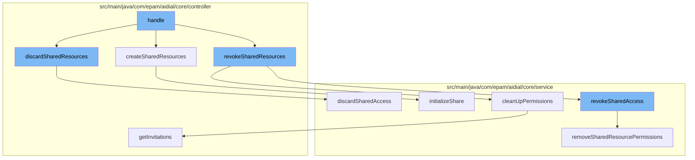

This document will cover the process of managing shared resources in the ai-dial-core-demo project. We'll cover:

1. How shared resources are discarded
2. How shared resources are created
3. How shared resources are revoked



<SwmSnippet path="/src/main/java/com/epam/aidial/core/controller/ShareController.java" line="115">

---

# Discarding Shared Resources

The `discardSharedResources` function is the entry point for discarding shared resources. It retrieves the request body, builds the bucket location, and calls the `discardSharedAccess` function from the `shareService`.

```java
    public Future<?> discardSharedResources() {
        return context.getRequest()
                .body()
                .compose(buffer -> {
                    ResourceLinkCollection request = getResourceLinkCollection(buffer, Operation.DISCARD);
                    String bucketLocation = BlobStorageUtil.buildInitiatorBucket(context);
                    String bucket = encryptionService.encrypt(bucketLocation);
                    return proxy.getVertx()
                            .executeBlocking(() -> {
                                shareService.discardSharedAccess(bucket, bucketLocation, request);
                                return null;
                            }, false);
                })
                .onSuccess(response -> context.respond(HttpStatus.OK))
                .onFailure(this::handleServiceError);
    }
```

---

</SwmSnippet>

<SwmSnippet path="/src/main/java/com/epam/aidial/core/service/ShareService.java" line="109">

---

# Creating Shared Resources

The `initializeShare` function is responsible for creating shared resources. It validates the resources, creates an invitation, and returns an invitation link.

```java
    /**
     * Initialize share request by creating invitation object
     *
     * @param bucket - user bucket
     * @param location - storage location
     * @param request - request body
     * @return invitation link
     */
    public InvitationLink initializeShare(String bucket, String location, ShareResourcesRequest request) {
        // validate resources - owner must be current user
        Set<SharedResource> sharedResources = request.getResources();
        if (sharedResources.isEmpty()) {
            throw new IllegalArgumentException("No resources provided");
        }

        Set<String> uniqueLinks = new HashSet<>();
        List<SharedResource> normalizedResourceLinks = new ArrayList<>(sharedResources.size());
        for (SharedResource sharedResource : sharedResources) {
            ResourceDescription resource = getResourceFromLink(sharedResource.url());
            if (!bucket.equals(resource.getBucketName())) {
                throw new IllegalArgumentException("Resource %s does not belong to the user".formatted(resource.getUrl()));
```

---

</SwmSnippet>

<SwmSnippet path="/src/main/java/com/epam/aidial/core/controller/ShareController.java" line="259">

---

# Revoking Shared Resources

The `revokeSharedAccess` function is responsible for revoking access to shared resources. It validates the resources, removes shared resource permissions, and updates the resource state.

```java

```

---

</SwmSnippet>

&nbsp;

*This is an auto-generated document by Swimm AI 🌊 and has not yet been verified by a human*

<SwmMeta version="3.0.0" repo-id="Z2l0aHViJTNBJTNBYWktZGlhbC1jb3JlLWRlbW8lM0ElM0FTd2ltbS1EZW1v" repo-name="ai-dial-core-demo" doc-type="flows"><sup>Powered by [Swimm](/)</sup></SwmMeta>
