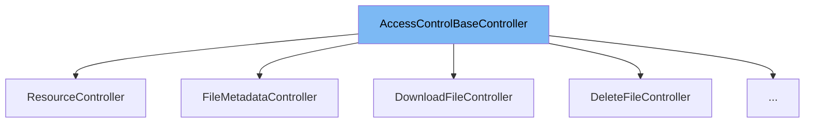

This document will cover the AccessControlBaseController class. We'll cover:

1. What is AccessControlBaseController
2. Variables and functions in AccessControlBaseController
3. Usage example of AccessControlBaseController



# What is AccessControlBaseController

AccessControlBaseController is an abstract class that provides a base for all controllers that need to control access to resources. It is used to handle requests and check if the user has the necessary permissions to access the requested resource.

<SwmSnippet path="/src/main/java/com/epam/aidial/core/controller/AccessControlBaseController.java" line="17">

---

# Variables and functions

The class has three instance variables: `proxy`, `context`, and `isWriteAccess`. `proxy` is an instance of the Proxy class, `context` is an instance of the ProxyContext class, and `isWriteAccess` is a boolean that indicates whether write access is required.

```java
    final Proxy proxy;
    final ProxyContext context;
    final boolean isWriteAccess;
```

---

</SwmSnippet>

<SwmSnippet path="/src/main/java/com/epam/aidial/core/controller/AccessControlBaseController.java" line="21">

---

The `handle` function is used to handle requests. It takes a resource URL as input, checks if the user has the necessary permissions to access the resource, and responds accordingly.

```java
    public Future<?> handle(String resourceUrl) {
        ResourceDescription resource;

        try {
            resource = ResourceDescription.fromAnyUrl(resourceUrl, proxy.getEncryptionService());
        } catch (IllegalArgumentException e) {
            String errorMessage = e.getMessage() != null ? e.getMessage() : ("Invalid resource url provided: " + resourceUrl);
            context.respond(HttpStatus.BAD_REQUEST, errorMessage);
            return Future.succeededFuture();
        }

        return proxy.getVertx()
                .executeBlocking(() -> {
                    AccessService service = proxy.getAccessService();
                    return service.lookupPermissions(Set.of(resource), context).get(resource);
                }, false)
                .map(permissions -> {
                    boolean hasAccess = permissions.contains(isWriteAccess
                            ? ResourceAccessType.WRITE : ResourceAccessType.READ);
                    if (hasAccess) {
                        handle(resource, permissions.contains(ResourceAccessType.WRITE));
```

---

</SwmSnippet>

<SwmSnippet path="/src/main/java/com/epam/aidial/core/controller/AccessControlBaseController.java" line="49">

---

The `handle` function is an abstract function that is implemented in subclasses of AccessControlBaseController. It takes a ResourceDescription and a boolean indicating whether write access is required as input.

```java
    protected abstract Future<?> handle(ResourceDescription resource, boolean hasWriteAccess);
```

---

</SwmSnippet>

<SwmSnippet path="/src/main/java/com/epam/aidial/core/controller/ResourceController.java" line="31">

---

# Usage example

The ResourceController class is an example of a class that extends AccessControlBaseController. It uses the `handle` function to handle requests and check access permissions.

```java
public class ResourceController extends AccessControlBaseController {
```

---

</SwmSnippet>

&nbsp;

*This is an auto-generated document by Swimm AI 🌊 and has not yet been verified by a human*

<SwmMeta version="3.0.0" repo-id="Z2l0aHViJTNBJTNBYWktZGlhbC1jb3JlLWRlbW8lM0ElM0FTd2ltbS1EZW1v" repo-name="ai-dial-core-demo" doc-type="class"><sup>Powered by [Swimm](/)</sup></SwmMeta>
