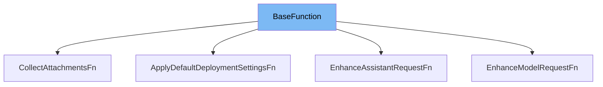

This document will cover the `BaseFunction` class. We'll cover:

1. What is `BaseFunction`
2. Variables and functions in `BaseFunction`
3. Usage example of `BaseFunction`



# What is BaseFunction

`BaseFunction` is an abstract class that implements the `Function` interface from `java.util.function`. It is used as a base for other functions in the project, providing a unified structure and common functionality.

<SwmSnippet path="/src/main/java/com/epam/aidial/core/function/BaseFunction.java" line="9">

---

# Variables and functions

The variable `proxy` is an instance of the `Proxy` class. It is used to perform operations related to the proxy.

```java
    protected final Proxy proxy;
```

---

</SwmSnippet>

<SwmSnippet path="/src/main/java/com/epam/aidial/core/function/BaseFunction.java" line="10">

---

The variable `context` is an instance of the `ProxyContext` class. It is used to store and manage the context of the proxy.

```java
    protected final ProxyContext context;
```

---

</SwmSnippet>

<SwmSnippet path="/src/main/java/com/epam/aidial/core/function/BaseFunction.java" line="12">

---

The `BaseFunction` constructor is used to initialize the `proxy` and `context` variables.

```java
    public BaseFunction(Proxy proxy, ProxyContext context) {
        this.proxy = proxy;
        this.context = context;
    }
```

---

</SwmSnippet>

# Usage example

`BaseFunction` is used as a base class for other function classes in the project. For example, in the `EnhanceAssistantRequestFn` class, `BaseFunction` is extended to provide specific functionality for enhancing assistant requests.

<SwmSnippet path="/src/main/java/com/epam/aidial/core/function/enhancement/EnhanceAssistantRequestFn.java" line="27">

---

# Usage example

Here, `BaseFunction` is extended by `EnhanceAssistantRequestFn`. The `proxy` and `context` are passed to the `BaseFunction` constructor.

```java
public class EnhanceAssistantRequestFn extends BaseFunction<ObjectNode> {
    public EnhanceAssistantRequestFn(Proxy proxy, ProxyContext context) {
```

---

</SwmSnippet>

&nbsp;

*This is an auto-generated document by Swimm AI 🌊 and has not yet been verified by a human*

<SwmMeta version="3.0.0" repo-id="Z2l0aHViJTNBJTNBYWktZGlhbC1jb3JlLWRlbW8lM0ElM0FTd2ltbS1EZW1v" repo-name="ai-dial-core-demo" doc-type="class"><sup>Powered by [Swimm](/)</sup></SwmMeta>
