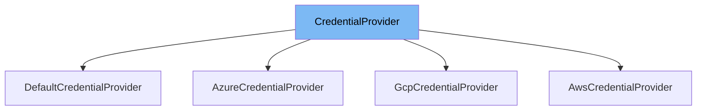

This document will cover the `CredentialProvider` interface. We'll cover:

1. What is `CredentialProvider`
2. Variables and functions in `CredentialProvider`
3. Usage example of `CredentialProvider`



# What is CredentialProvider

`CredentialProvider` is an interface in the `ai-dial-core-demo` project. It is used to provide a unified way to get credentials for different storage options. The `CredentialProvider` interface is implemented by different classes to provide credentials for specific storage providers like AWS S3, Google Cloud Storage, and Azure Blob Store.

# Variables and functions

`CredentialProvider` does not have any variables as it is an interface. It has a single function `getCredentials`.

<SwmSnippet path="/src/main/java/com/epam/aidial/core/storage/credential/CredentialProvider.java" line="7">

---

## Function: getCredentials

The function `getCredentials` is declared in the `CredentialProvider` interface. This function is used to get the credentials required for accessing the storage. The specific implementation of this function depends on the class implementing the `CredentialProvider` interface.

```java
    Credentials getCredentials();
```

---

</SwmSnippet>

<SwmSnippet path="/src/main/java/com/epam/aidial/core/storage/credential/DefaultCredentialProvider.java" line="7">

---

# Usage example

`DefaultCredentialProvider` is an example of a class that implements the `CredentialProvider` interface. It provides a default implementation for the `getCredentials` function.

```java
public class DefaultCredentialProvider implements CredentialProvider {
```

---

</SwmSnippet>

&nbsp;

*This is an auto-generated document by Swimm AI 🌊 and has not yet been verified by a human*

<SwmMeta version="3.0.0" repo-id="Z2l0aHViJTNBJTNBYWktZGlhbC1jb3JlLWRlbW8lM0ElM0FTd2ltbS1EZW1v" repo-name="ai-dial-core-demo" doc-type="class"><sup>Powered by [Swimm](/)</sup></SwmMeta>
