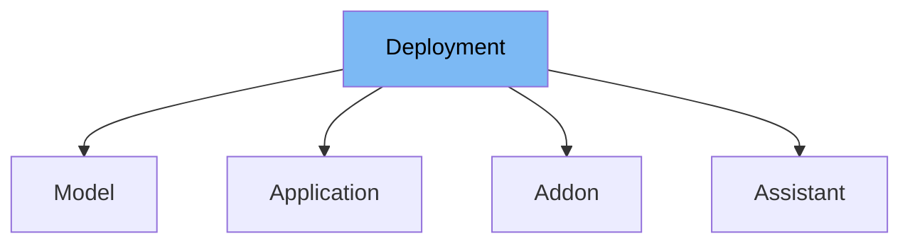

This document will cover the Deployment class in the ai-dial-core-demo project. We'll cover:

1. What is Deployment
2. Variables and functions in Deployment
3. Usage example of Deployment



# What is Deployment

The Deployment class is an abstract class that represents a deployment configuration in the ai-dial-core-demo project. It is used to store information about a deployment, such as its name, endpoint, display name, and other related properties.

<SwmSnippet path="/src/main/java/com/epam/aidial/core/config/Deployment.java" line="11">

---

# Variables in Deployment

The variable `name` is used to store the name of the deployment.

```java
    private String name;
```

---

</SwmSnippet>

<SwmSnippet path="/src/main/java/com/epam/aidial/core/config/Deployment.java" line="12">

---

The variable `endpoint` is used to store the endpoint of the deployment.

```java
    private String endpoint;
```

---

</SwmSnippet>

<SwmSnippet path="/src/main/java/com/epam/aidial/core/config/Deployment.java" line="13">

---

The variable `displayName` is used to store the display name of the deployment.

```java
    private String displayName;
```

---

</SwmSnippet>

<SwmSnippet path="/src/main/java/com/epam/aidial/core/config/Deployment.java" line="14">

---

The variable `displayVersion` is used to store the display version of the deployment.

```java
    private String displayVersion;
```

---

</SwmSnippet>

<SwmSnippet path="/src/main/java/com/epam/aidial/core/config/Deployment.java" line="15">

---

The variable `iconUrl` is used to store the icon URL of the deployment.

```java
    private String iconUrl;
```

---

</SwmSnippet>

<SwmSnippet path="/src/main/java/com/epam/aidial/core/config/Deployment.java" line="16">

---

The variable `description` is used to store the description of the deployment.

```java
    private String description;
```

---

</SwmSnippet>

<SwmSnippet path="/src/main/java/com/epam/aidial/core/config/Deployment.java" line="17">

---

The variable `userRoles` is used to store the user roles of the deployment.

```java
    private Set<String> userRoles = Set.of();
```

---

</SwmSnippet>

<SwmSnippet path="/src/main/java/com/epam/aidial/core/config/Deployment.java" line="22">

---

The variable `forwardAuthToken` is used to determine whether to forward the authorization token when a request is sent to the deployment.

```java
    private boolean forwardAuthToken = false;
```

---

</SwmSnippet>

<SwmSnippet path="/src/main/java/com/epam/aidial/core/config/Deployment.java" line="23">

---

The variable `features` is used to store the features of the deployment.

```java
    private Features features;
```

---

</SwmSnippet>

<SwmSnippet path="/src/main/java/com/epam/aidial/core/config/Deployment.java" line="24">

---

The variable `inputAttachmentTypes` is used to store the input attachment types of the deployment.

```java
    private List<String> inputAttachmentTypes;
```

---

</SwmSnippet>

<SwmSnippet path="/src/main/java/com/epam/aidial/core/config/Deployment.java" line="25">

---

The variable `maxInputAttachments` is used to store the maximum number of input attachments of the deployment.

```java
    private Integer maxInputAttachments;
```

---

</SwmSnippet>

<SwmSnippet path="/src/main/java/com/epam/aidial/core/config/Deployment.java" line="29">

---

The variable `defaults` is used to store the default parameters of the deployment.

```java
    private Map<String, Object> defaults = Map.of();
```

---

</SwmSnippet>

# Usage example

The Deployment class is an abstract class and is not directly used. Instead, other classes extend it to create specific deployment configurations. An example of this is the Model class, which extends the Deployment class and provides specific configurations for a model deployment.

&nbsp;

*This is an auto-generated document by Swimm AI 🌊 and has not yet been verified by a human*

<SwmMeta version="3.0.0" repo-id="Z2l0aHViJTNBJTNBYWktZGlhbC1jb3JlLWRlbW8lM0ElM0FTd2ltbS1EZW1v" repo-name="ai-dial-core-demo" doc-type="general-class"><sup>Powered by [Swimm](/)</sup></SwmMeta>
