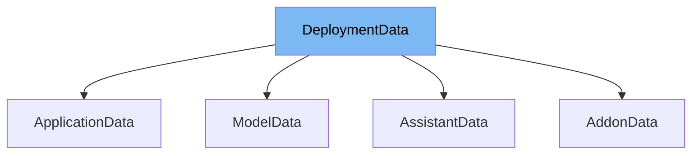

This document will cover the following aspects of the `DeploymentData` class:

1. What is `DeploymentData`
2. Variables and functions in `DeploymentData`
3. Usage example of `DeploymentData`



# What is DeploymentData

`DeploymentData` is a class in the `com.epam.aidial.core.data` package. It is used to represent the deployment data of different components such as models, addons, assistants, and applications in the AI Dial Core system.

<SwmSnippet path="/src/main/java/com/epam/aidial/core/data/DeploymentData.java" line="15">

---

# Variables in DeploymentData

The `id` variable is used to store the unique identifier of the deployment.

```java
    private String id;
```

---

</SwmSnippet>

<SwmSnippet path="/src/main/java/com/epam/aidial/core/data/DeploymentData.java" line="16">

---

The `model` variable is used to store the model associated with the deployment.

```java
    private String model;
```

---

</SwmSnippet>

<SwmSnippet path="/src/main/java/com/epam/aidial/core/data/DeploymentData.java" line="17">

---

The `addon` variable is used to store the addon associated with the deployment.

```java
    private String addon;
```

---

</SwmSnippet>

<SwmSnippet path="/src/main/java/com/epam/aidial/core/data/DeploymentData.java" line="18">

---

The `assistant` variable is used to store the assistant associated with the deployment.

```java
    private String assistant;
```

---

</SwmSnippet>

<SwmSnippet path="/src/main/java/com/epam/aidial/core/data/DeploymentData.java" line="19">

---

The `application` variable is used to store the application associated with the deployment.

```java
    private String application;
```

---

</SwmSnippet>

<SwmSnippet path="/src/main/java/com/epam/aidial/core/data/DeploymentData.java" line="29">

---

# Functions in DeploymentData

The `scaleSettings` function is used to store the scale settings of the deployment.

```java
    private ScaleSettingsData scaleSettings = new ScaleSettingsData();
```

---

</SwmSnippet>

<SwmSnippet path="/src/main/java/com/epam/aidial/core/data/DeploymentData.java" line="30">

---

The `features` function is used to store the features of the deployment.

```java
    private FeaturesData features = new FeaturesData();
```

---

</SwmSnippet>

<SwmSnippet path="/src/main/java/com/epam/aidial/core/data/ApplicationData.java" line="13">

---

# Usage example

`DeploymentData` is extended by `ApplicationData` class. This means all the variables and functions of `DeploymentData` are available in `ApplicationData`.

```java
public class ApplicationData extends DeploymentData {
```

---

</SwmSnippet>

&nbsp;

*This is an auto-generated document by Swimm AI 🌊 and has not yet been verified by a human*

<SwmMeta version="3.0.0" repo-id="Z2l0aHViJTNBJTNBYWktZGlhbC1jb3JlLWRlbW8lM0ElM0FTd2ltbS1EZW1v" repo-name="ai-dial-core-demo" doc-type="class"><sup>Powered by [Swimm](/)</sup></SwmMeta>
